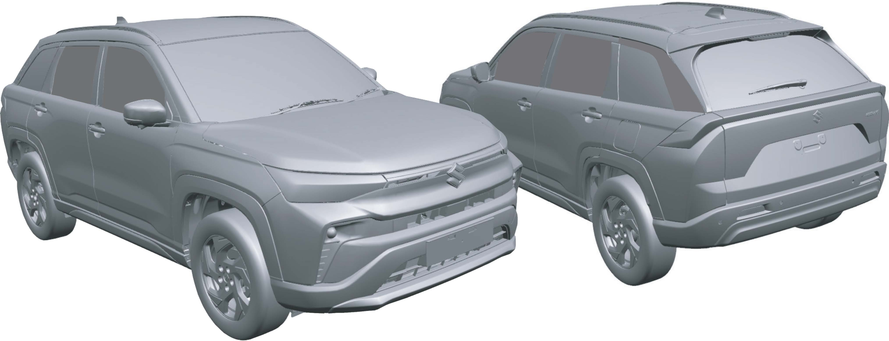
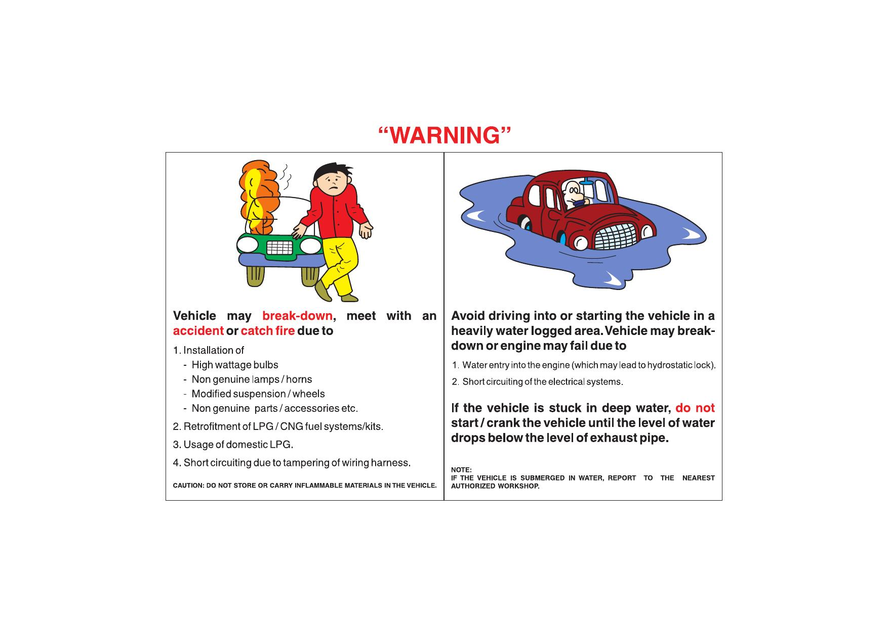

# Preamble
## About This Manual
This Owner's Manual applies to the VICTORIS series produced by MARUTI SUZUKI INDIA LIMITED.

NOTE: The illustrated model is one of the VICTORIS series. Accessories shown in the picture are not part of standard equipment.

© Copyright 2025 **Maruti Suzuki India Limited.** All rights reserved. No part of this manual can be reproduced in any manner whatsoever or transmitted in any form or by any means without prior written consent of Maruti Suzuki India Limited.

## Foreword
This manual is an essential part of your vehicle and should remain with the vehicle when resold or otherwise transferred to a new owner or operator. Please read this manual carefully before operating your new MARUTI SUZUKI and review the manual from time to time. It contains important information on safety, operation and maintenance. You are invited to avail the three Free Inspection Services as described in the manual. Three free inspection coupons are attached to this manual. Please show this manual to your dealer workshop while you take your MARUTI SUZUKI for any Service.

To prolong the life of your vehicle and reduce maintenance cost, the periodic maintenance must be carried out according to "PERIODIC MAINTENANCE SCHEDULE" described in "INSPECTION AND MAINTENANCE" section of this manual. It is essential for preventing trouble and accidents to ensure your satisfaction and safety.

Daily inspection and care as per "DAILY INSPECTION CHECKLIST" described in the "OPERATING YOUR VEHICLE" section of this manual is essential for prolonging the life of the vehicle and for safe driving.

Vehicle and the available features/accessories therein should be used and plied by the owner/user in accordance with the applicable legal requirements.

MARUTI SUZUKI INDIA LIMITED believes in conservation and protection of Earth's natural resources. To that end, we encourage every vehicle owner to recycle, trade-in or properly dispose of, as appropriate, used Engine Oil, coolant and other fluids, batteries and tyres etc.

> All information in this manual is based on the latest product information available at the time of publication. Due to improvements or other changes, there may be discrepancies between information in this manual and your vehicle. MARUTI SUZUKI INDIA LIMITED reserves the right to make production changes at any time, without notice and without incurring any obligation to make the same or similar changes to vehicles previously built or sold.
>
> This vehicle may not comply with standards or regulations of other countries. Before attempting to register this vehicle in any other country, check all applicable regulations and make any necessary modifications.

**MARUTI SUZUKI INDIA LIMITED**

## Important — Signal Words
Please read this manual and follow its instructions carefully. To emphasize special information, the symbol and the words **WARNING**, **CAUTION**, ***NOTICE*** and *NOTE* have special meanings. Pay particular attention to messages highlighted by these signal words:

**⚠ WARNING** — Indicates a potential hazard that could result in death or serious injury.

**⚠ CAUTION** — Indicates a potential hazard that could result in minor or moderate injury.

***NOTICE*** — Indicates a potential hazard that could result in vehicle damage.

*NOTE — Indicates special information to make maintenance easier or instructions clearer.*

The circle with a slash in this manual means "Don't do this" or "Don't let this happen."

NOTE:
- Words like car, model/variant are invariably used in this manual to denote the "Vehicle".
- Pictorial representations used in this manual are for reference purposes only.

## Modification Warning
**⚠ WARNING:** Do not modify your vehicle. Modification could adversely affect safety, handling, performance, or durability and may violate governmental regulations. In addition, damage or performance problems resulting from modification may not be covered under warranty.

***NOTICE:*** Improper installation of mobile communication equipment such as cellular telephones, CB (Citizen's Band) radios may cause electronic interference with your vehicle's ignition system, resulting in vehicle performance problems. Consult your Maruti Suzuki authorised workshop or qualified service technician for advice on installing such mobile communication equipment.

***NOTICE:*** The diagnostic connector of your vehicle is prepared only for the specific diagnostic tool for inspection and service purpose. Connecting any other tool or device may interfere with electronic parts operations and cause running out of batteries.

## Warning — Illustrated

**Vehicle may break-down, meet with an accident or catch fire due to:**
1. Installation of high wattage bulbs, non genuine lamps/horns, modified suspension/wheels, or non genuine parts/accessories.
2. Retrofitment of LPG/CNG fuel systems/kits.
3. Usage of domestic LPG.
4. Short circuiting due to tampering of wiring harness.

CAUTION: Do not store or carry inflammable materials in the vehicle.

**Avoid driving into or starting the vehicle in a heavily water logged area. Vehicle may break-down or engine may fail due to:**
1. Water entry into the engine (which may lead to hydrostatic lock).
2. Short circuiting of the electrical systems.

**If the vehicle is stuck in deep water, do not start/crank the vehicle until the level of water drops below the level of exhaust pipe.**

NOTE: If the vehicle is submerged in water, report to the nearest authorized workshop.

## Caution
1. Retro-fitment of LPG/CNG kit may deteriorate vehicle performance, reduce engine & engine related component's life and also warranty will be null and void for such vehicles.
2. Do not use domestic LPG/LPG cylinder for your factory fitted LPG vehicles.
3. Usage of domestic LPG for running vehicles is prohibited as per law.
4. Do not remove company fitted LPG/CNG kit to install some other kit. It may affect vehicle performance and may cause fire.
5. Drive slowly on wet roads. Tyres may slip while braking at higher speeds due to aquaplaning (reduced contact area between tyre and road due to presence of water).
6. Do not leave engine running in garages or confined areas, with passengers inside. This may result in accumulation of carbon-monoxide in cabin and may lead to suffocation or breathing problems.
7. Do not park vehicle on dry leaves or grass. This may lead to fire due to hot catalytic converter, igniting the dry leaves/grass.
8. If the vehicle is equipped with CNG/LPG, ensure availability of fire extinguisher in the vehicle all the time.
9. Always wear seat belt at all times.
10. Do not use mobile phone while driving.
11. Avoid smoking in the car; live bud thrown in car may cause fire.
12. Do not put any body part under the vehicle when it is supported on a Jack.
13. Do not use non-genuine accessories in your vehicle.
14. Do not fit accessories from unauthorized workshops/sources.
15. Usage of non-approved electrical accessories in your vehicle may result in spark, fire or personal injury.
16. Do not use camphor, incense sticks inside cabin room. Doing so may cause fire.
17. Avoid usage of cellular phones while refueling. Electric current and/or electronic interference from cellular phones can potentially ignite fuel vapors and cause fire.
18. Avoid entry inside vehicle immediately once after you have begun refueling. You can generate a build up of static electricity by touching, rubbing or sliding against any item or fabric capable of producing static electricity. Static electricity discharge can ignite fuel vapors and may causing a fire.
19. Do not check the engine room/open the hood near the fire area (outside the vehicle). Fuel, washer fluid, etc. are flammable oils that may cause fire.
20. Avoid driving when vehicle has met with an accident. Before driving, please contact with authorized MSIL dealership.

## Digital Owner's Manual
To experience and use the Digital Owner's Manual, download the Maruti Suzuki Rewards app.

The **Maruti Suzuki Rewards** app ensures a hassle free car ownership experience. Get easy access to all the services and information you need by downloading the app (available on Google Play and the App Store).

**How to download Owner's Manual from Maruti Suzuki application:**
1. Download "Maruti Suzuki Rewards" from the Apple App Store or Google Play Store.
2. Input your registered mobile number and the OTP received by SMS.
3. Select "S-Assist BOT" icon and click "View Owner's Manual" to access the digital Owner's Manual.
4. Click "Down Arrow" to download and save the Owner's Manual on your mobile phone.

Now, the Owner's Manual is available on your mobile phone for reference at all times.

(For assistance, contact Maruti Suzuki authorized workshop.)

## Warranty Policy
Maruti Suzuki India Limited (hereinafter called "Maruti Suzuki"), warrants that each new Maruti Suzuki vehicle distributed in India by Maruti Suzuki and sold by a Maruti Suzuki authorized dealer will be free, under normal use and service, from any defects in material and workmanship at the time of manufacture SUBJECT TO THE FOLLOWING TERMS AND CONDITIONS:

### (1) Qualification
To qualify for this warranty the vehicle must be delivered by a Maruti Suzuki authorized dealer and set-up, and serviced by a Maruti Suzuki authorized workshop.

### (2) Term
The term of the warranty shall be Thirty-Six (36) months or 1,00,000 kilometers (whichever occurs first) from the date of invoice to the first owner.

NOTE: Maruti Suzuki offers warranty for the below parts in vehicle, if equipped, as follows:
- Lithium-ion battery, Integrated Starter Generator (ISG), Hybrid ECU, Inverter/Converter Unit, Power Management ECU — Sixty (60) months or 1,00,000 kilometers (whichever occurs first).
- Hybrid Electric Vehicle (HEV) Battery — Ninety six (96) months or 1,60,000 kilometers (whichever occurs first).

### (3) Maruti Suzuki Warranty Obligation
If any defect(s) should be found in a Maruti Suzuki vehicle within the term stipulated above, Maruti Suzuki's only obligation is to repair or replace at its sole discretion any part shown to be defective, with a new part or the equivalent at no cost to the owner for parts or labor, when Maruti Suzuki acknowledges that such a defect is attributable to faulty material or workmanship at the time of manufacture. Such defective parts, which have been replaced, will become the property of Maruti Suzuki. The owner is responsible for any repair or replacements which are not covered by this warranty. The decision of Maruti Suzuki shall be final & binding.

### (4) Limitation
This warranty shall not apply to:

(a) Normal maintenance service required other than the three free services, including without limitation, oil and fluid changes, Consumables, headlight aiming, fastener retightening, wheel balancing, wheel alignment and tyre rotation, cleaning of injectors, adjustments of clutch and valve clearance.
(b) The normal wear of parts including without limitation, bulbs, tyres and tubes, spark plugs, belts, hoses, filters, wiper blades, brushes, contact points, fuses, clutch disc, brake shoes, brake pads, cable and all rubber parts (except oil seal and glass run).
(c) Any vehicle which has been used for competition, rallies or racing.
(d) Any repairs or replacement arising from accidents or collision.
(e) Any defect/damage caused by misuse, negligence, abnormal use, insufficient care, vandalism, theft, riot, fire, flooding — not limited to entry of water in the components resulting in engine seizure, hydrostatic lock, etc. or external damages to the body/components.
(f) Any damage resulting due to usage of adulterated fuel/lubricants/oil/coolant/fluids/polishing products and fuel/lubricants/oil/coolant/fluids used other than those specified in the Owner's Manual.
(g) Any vehicle which has been modified or altered, including without limitation, the installation of performance accessories, enlargements of lights, other changes and external/consequential reasons.
(h) Any vehicle on which parts or accessories not approved by Maruti Suzuki (Non-MSGA, Non-MSGP) have been used.
(i) Any vehicle which has not been operated in accordance with the operating instructions in this Owner's Manual and Service Booklet.
(j) Any vehicle which has not received the service inspections prescribed in this Owner's Manual and Service Booklet.
(k) Any vehicle which has been assembled, disassembled, adjusted or repaired by other than a Maruti Suzuki authorized workshop.
(l) Any vehicle which has been used for purposes other than what it was designed for.
(m) Any damage or deterioration caused by airborne fallout, industrial fallout, acid rain, hail or hail storm, wind storm, lightning, bird droppings, rodents bite/rat bite and such other thing that result in damage to the vehicle.
(n) Insignificant defects/noise which do not affect the function of the vehicle including without limitation, sound, vibration and fluid seep.
(o) Any natural wear and tear including without limitation, ageing, wear & tear or deterioration such as discoloration, fading, deformation or blurring and fabric discoloration.
(p) Installation and usage of domestic LPG gas/LPG Cylinder.
(q) V-belts, hoses and gas leaks.
(r) Any vehicle retrofitted with LPG/CNG kits.
(s) Repainting including patchwork, bodywork and mouldings and interior trims.
(t) Corrosion, rusting of body parts and/or components.
(u) Any vehicle on which odometer has been changed unauthorizedly or odometer reading has been modified/tampered with/or not matching the service records.
(v) The damage(s) caused to the vehicle being unattended despite knowledge that the defect exists and ignorance by the owner/user of the vehicle.
(w) Any damage(s) caused to vehicle including battery/tyre due to parking of the vehicle in idle condition for long duration of time periods.
(x) Any vehicle on which the retro-fitment is not authorized and/or type approved as per the standards prescribed by the relevant authority including but not limited to Automotive Standards of India.
(y) Any vehicle on which the retro-fitment is such which directly or indirectly causes any damage to the vehicle or affects the functions of the vehicle in any manner whatsoever.

### (5) Extent of Warranty
This warranty is the entire written warranty given by Maruti Suzuki for Maruti Suzuki vehicles and no dealer or its or his agent or employee is authorized to extend or enlarge this warranty and no dealer or its or his agent or employee is authorized to make any oral warranty or representation or assurance on behalf of Maruti Suzuki.

Maruti Suzuki reserves the right to add any improvements or change the design of any model at any time with no obligation to make the same changes on units previously sold.

### (6) Warranty Service
To obtain warranty service, the complete vehicle must be presented at the owner's expenses to Maruti Suzuki authorized workshop.

The customer shall be responsible for his belongings or accessories fitted in the vehicle at the time of presenting the vehicle for service and no claim shall be entertained in any manner under any circumstances.

### (7) Owner's Warranty Obligations
***NOTICE:*** The owner shall not use the vehicle in a damaged condition and report the same immediately to the nearest Maruti Suzuki authorized workshop. This would result in early inspection and repair of the vehicle and any possible harm to the person or aggravation of damage to the vehicle can be prevented.

It is the responsibility of each owner to:
- Have performed, at his own expenses, by a Maruti Suzuki authorized workshop all the service inspections specified in the Owner's Manual described in "INSPECTION AND MAINTENANCE" section.
- Should you resell the vehicle, please guide the new users/owners to download this manual (from "Maruti Suzuki Rewards" mobile application with your registered mobile number). Also the soft copy of the manual must be passed on to new users/owners when resold or otherwise transferred.

If the Owner's Manual is lost due to any reason, the owner or user may download a soft copy of the same (from "Maruti Suzuki Rewards" mobile application with the mobile number) and save it for easy access at any point of time.

### (8) Disclaimer of Consequential Damage
Maruti Suzuki assumes no responsibility for loss of vehicle, loss of time, inconvenience or any other indirect incidental or consequential damage resulting from the vehicle not being available to the owner because of any defect covered by this warranty.

### (9) Change of Owner
Even if ownership of the vehicle changes, the remaining warranty period is effective for the new owner.

This warranty is applicable only in India and not transferable to any other country.

NOTE: Notwithstanding the warranty obligations, Maruti Suzuki may reuse reworked (refurbished) parts for undertaking rectification of recalled vehicles in terms of applicable laws.
