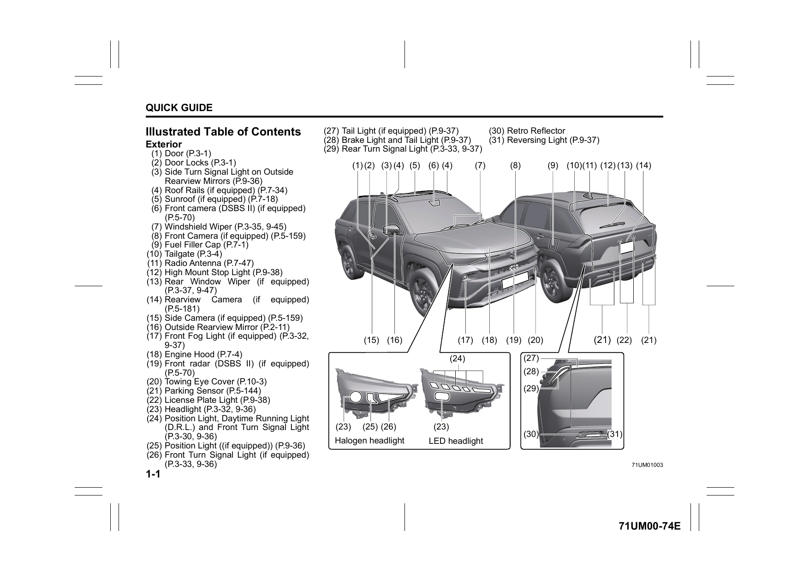
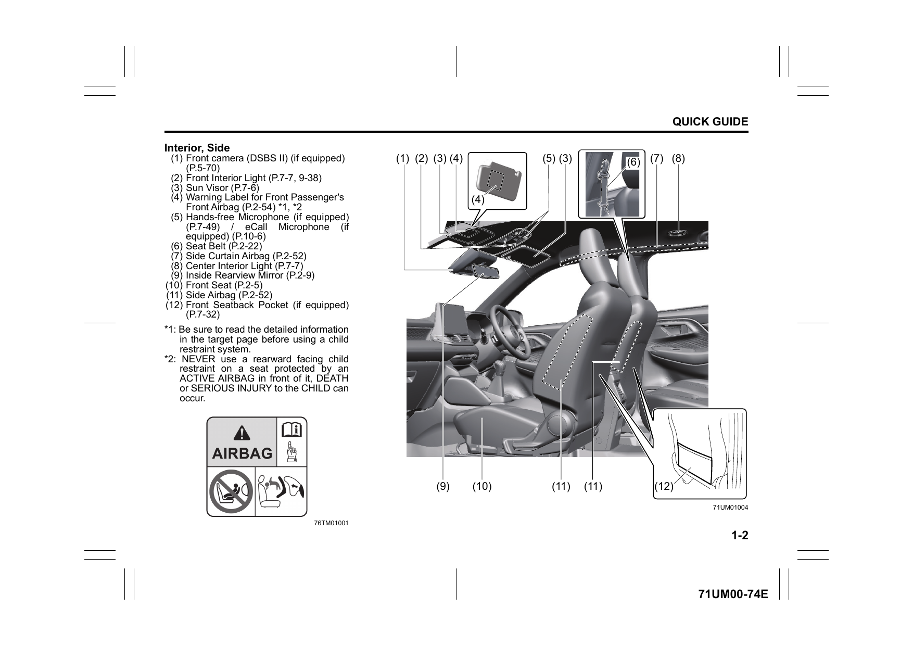
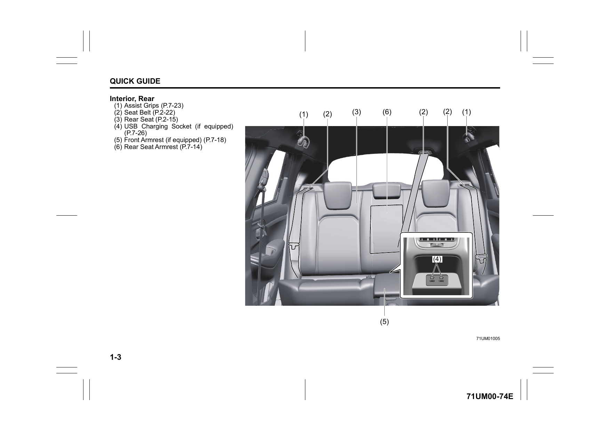
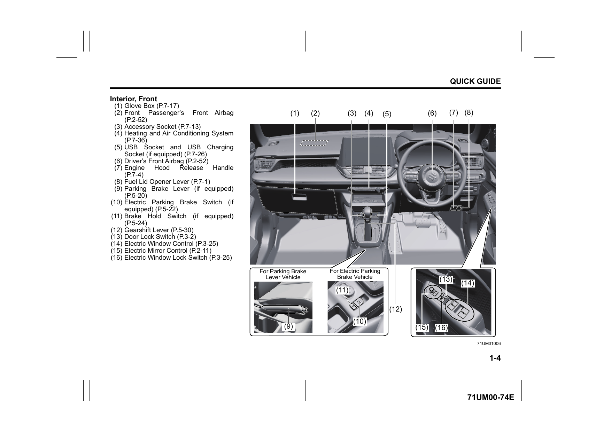
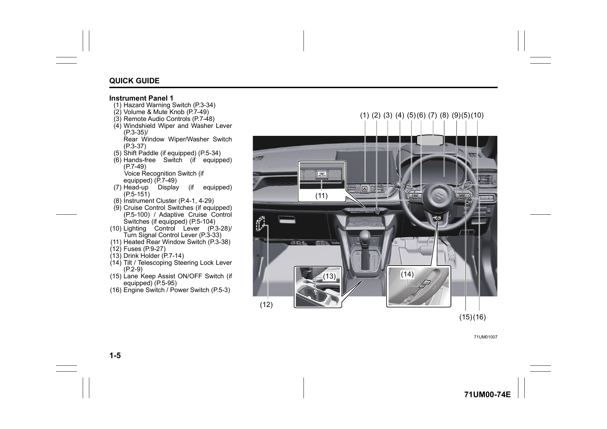
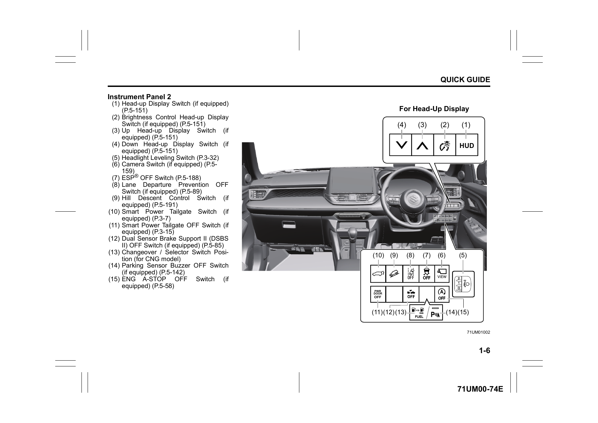
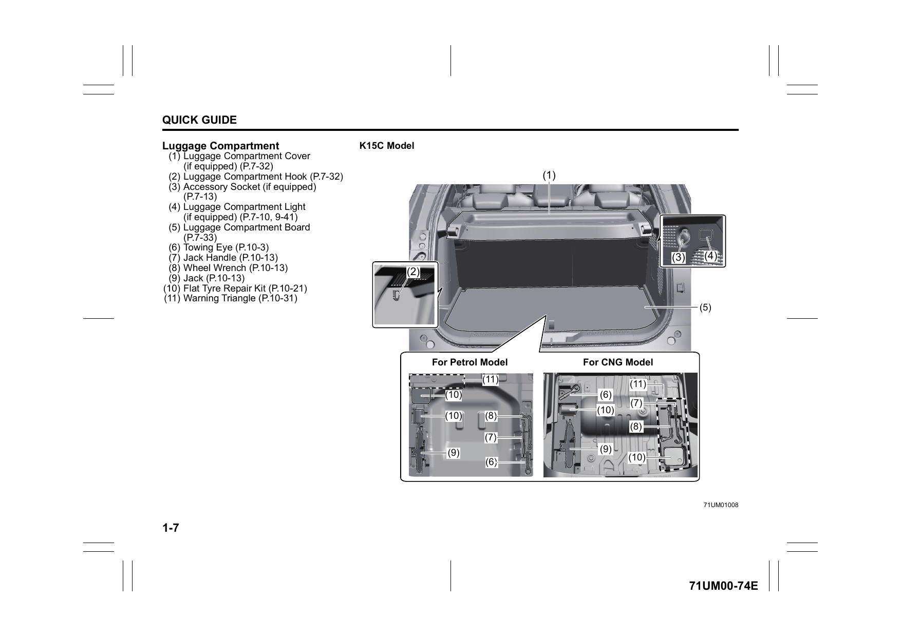
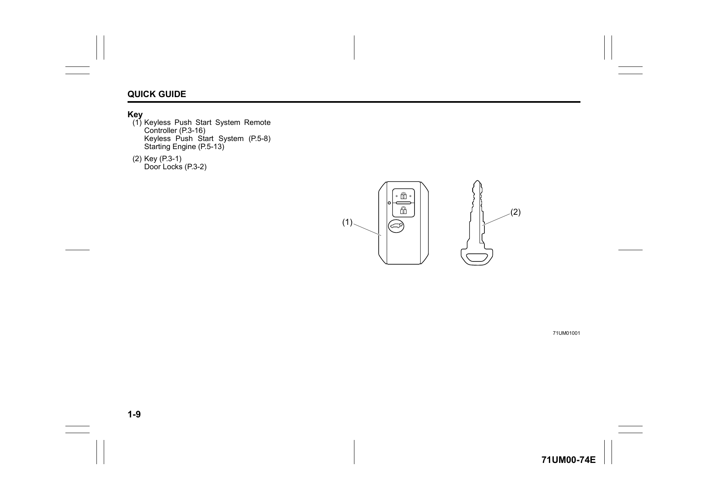

# Illustrated Table of Contents
## Exterior

| No. | Component |
|-----|-----------|
| (1) | Door |
| (2) | Door Locks |
| (3) | Side Turn Signal Light on Outside Rearview Mirrors |
| (4) | Roof Rails (if equipped) |
| (5) | Sunroof (if equipped) |
| (6) | Front camera (DSBS II) (if equipped) |
| (7) | Windshield Wiper |
| (8) | Front Camera (if equipped) |
| (9) | Fuel Filler Cap |
| (10) | Tailgate |
| (11) | Radio Antenna |
| (12) | High Mount Stop Light |
| (13) | Rear Window Wiper (if equipped) |
| (14) | Rearview Camera (if equipped) |
| (15) | Side Camera (if equipped) |
| (16) | Outside Rearview Mirror |
| (17) | Front Fog Light (if equipped) |
| (18) | Engine Hood |
| (19) | Front radar (DSBS II) (if equipped) |
| (20) | Towing Eye Cover |
| (21) | Parking Sensor (if equipped) |
| (22) | License Plate Light |
| (23) | Headlight |
| (24) | Position Light, Daytime Running Light (D.R.L.) and Front Turn Signal Light |
| (25) | Position Light (if equipped) |
| (26) | Front Turn Signal Light (if equipped) |
| (27) | Tail Light (if equipped) |
| (28) | Brake Light and Tail Light |
| (29) | Rear Turn Signal Light |
| (30) | Retro Reflector |
| (31) | Reversing Light |

## Interior, Side

| No. | Component |
|-----|-----------|
| (1) | Front camera (DSBS II) (if equipped) |
| (2) | Front Interior Light |
| (3) | Sun Visor |
| (4) | Warning Label for Front Passenger's Front Airbag |
| (5) | Hands-free Microphone (if equipped) / eCall Microphone (if equipped) |
| (6) | Seat Belt |
| (7) | Side Curtain Airbag |
| (8) | Center Interior Light |
| (9) | Inside Rearview Mirror |
| (10) | Front Seat |
| (11) | Side Airbag |
| (12) | Front Seatback Pocket (if equipped) |

> **NOTE:** Never use a rearward facing child restraint system on a seat protected by an ACTIVE AIRBAG in front of it — DEATH or SERIOUS INJURY to the CHILD can occur.

## Interior, Rear

| No. | Component |
|-----|-----------|
| (1) | Assist Grips |
| (2) | Seat Belt |
| (3) | Rear Seat |
| (4) | USB Charging Socket (if equipped) |
| (5) | Front Armrest (if equipped) |
| (6) | Rear Seat Armrest |

## Interior, Front

| No. | Component |
|-----|-----------|
| (1) | Glove Box |
| (2) | Front Passenger's Front Airbag |
| (3) | Accessory Socket |
| (4) | Heating and Air Conditioning System |
| (5) | USB Socket and USB Charging Socket (if equipped) |
| (6) | Driver's Front Airbag |
| (7) | Engine Hood Release Handle |
| (8) | Fuel Lid Opener Lever |
| (9) | Parking Brake Lever (if equipped) |
| (10) | Electric Parking Brake Switch (if equipped) |
| (11) | Brake Hold Switch (if equipped) |
| (12) | Gearshift Lever |
| (13) | Door Lock Switch |
| (14) | Electric Window Control |
| (15) | Electric Mirror Control |
| (16) | Electric Window Lock Switch |

## Instrument Panel 1

| No. | Component |
|-----|-----------|
| (1) | Hazard Warning Switch |
| (2) | Volume & Mute Knob |
| (3) | Remote Audio Controls |
| (4) | Windshield Wiper and Washer Lever / Rear Window Wiper/Washer Switch |
| (5) | Shift Paddle (if equipped) |
| (6) | Hands-free Switch (if equipped) / Voice Recognition Switch (if equipped) |
| (7) | Head-up Display (if equipped) |
| (8) | Instrument Cluster |
| (9) | Cruise Control Switches / Adaptive Cruise Control Switches (if equipped) |
| (10) | Lighting Control Lever / Turn Signal Control Lever |
| (11) | Heated Rear Window Switch |
| (12) | Fuses |
| (13) | Drink Holder |
| (14) | Tilt / Telescoping Steering Lock Lever |
| (15) | Lane Keep Assist ON/OFF Switch (if equipped) |
| (16) | Engine Switch / Power Switch |

## Instrument Panel 2

| No. | Component |
|-----|-----------|
| (1) | Head-up Display Switch (if equipped) |
| (2) | Brightness Control Head-up Display Switch (if equipped) |
| (3) | Up Head-up Display Switch (if equipped) |
| (4) | Down Head-up Display Switch (if equipped) |
| (5) | Headlight Leveling Switch |
| (6) | Camera Switch (if equipped) |
| (7) | ESP® OFF Switch |
| (8) | Lane Departure Prevention OFF Switch (if equipped) |
| (9) | Hill Descent Control Switch (if equipped) |
| (10) | Smart Power Tailgate Switch (if equipped) |
| (11) | Smart Power Tailgate OFF Switch (if equipped) |
| (12) | Dual Sensor Brake Support II (DSBS II) OFF Switch (if equipped) |
| (14) | Parking Sensor Buzzer OFF Switch (if equipped) |
| (15) | ENG A-STOP OFF Switch (if equipped) |

## Luggage Compartment

| No. | Component |
|-----|-----------|
| (1) | Luggage Compartment Cover (if equipped) |
| (2) | Luggage Compartment Hook |
| (3) | Accessory Socket (if equipped) |
| (4) | Luggage Compartment Light (if equipped) |
| (5) | Luggage Compartment Board |
| (6) | Towing Eye |
| (7) | Jack Handle |
| (8) | Wheel Wrench |
| (9) | Jack |
| (10) | Flat Tyre Repair Kit |
| (11) | Warning Triangle |

## Key

| No. | Component |
|-----|-----------|
| (1) | Keyless Push Start System Remote Controller |
| (2) | Key (emergency mechanical key) |
