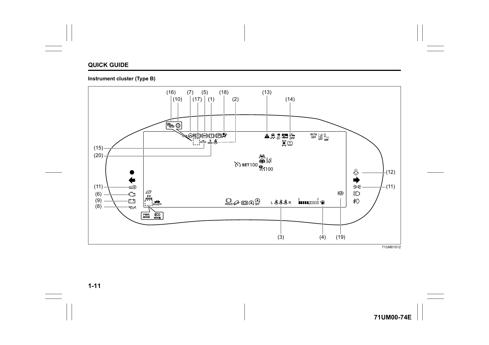
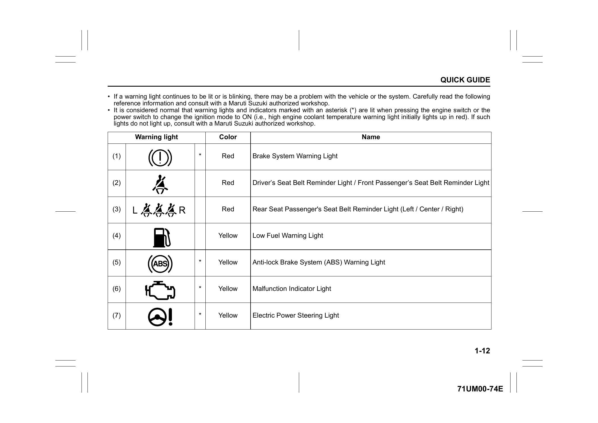
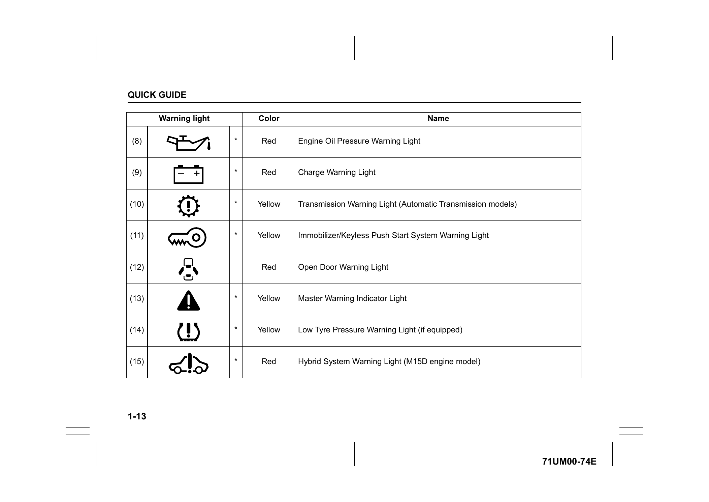
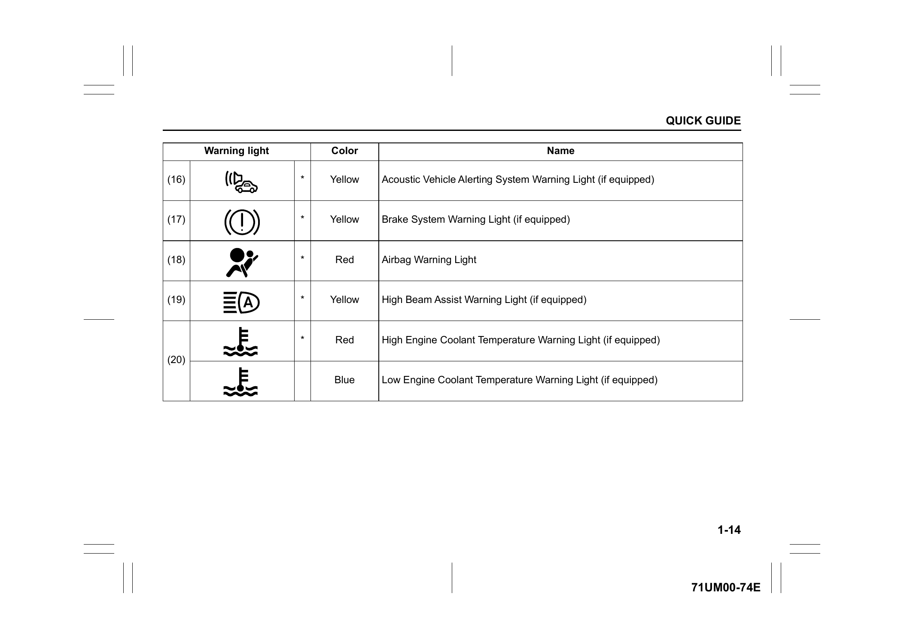
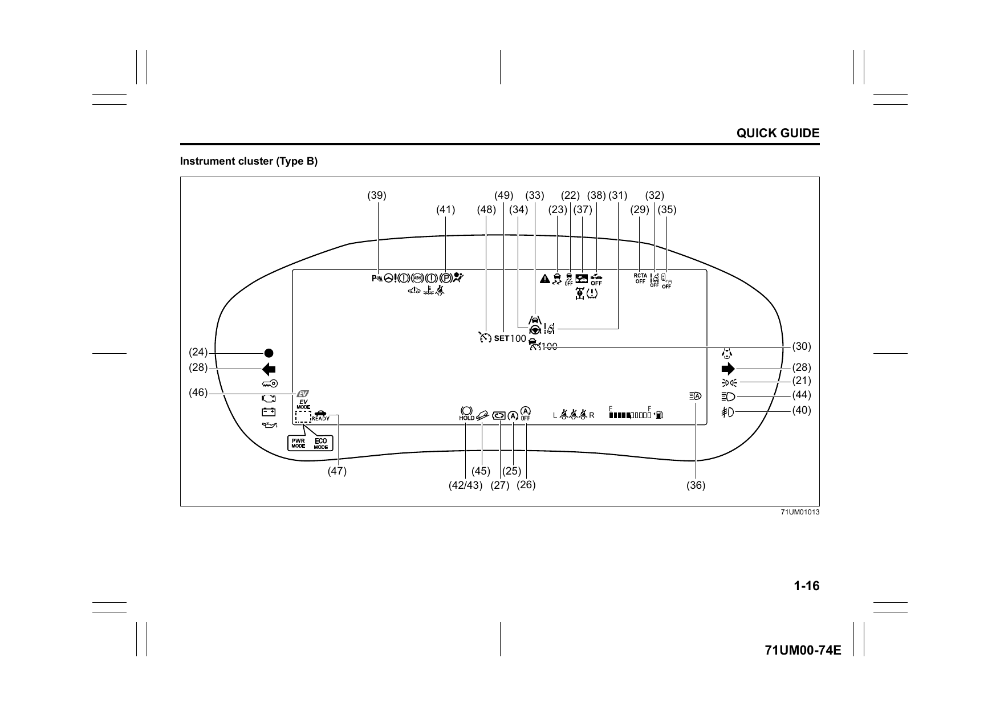
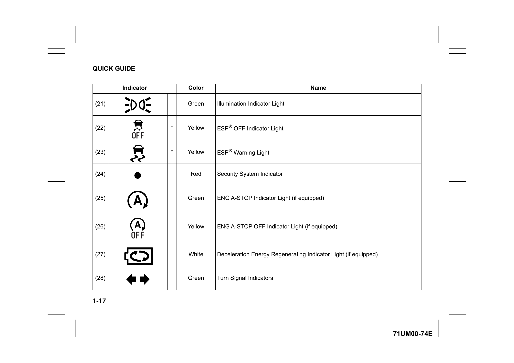
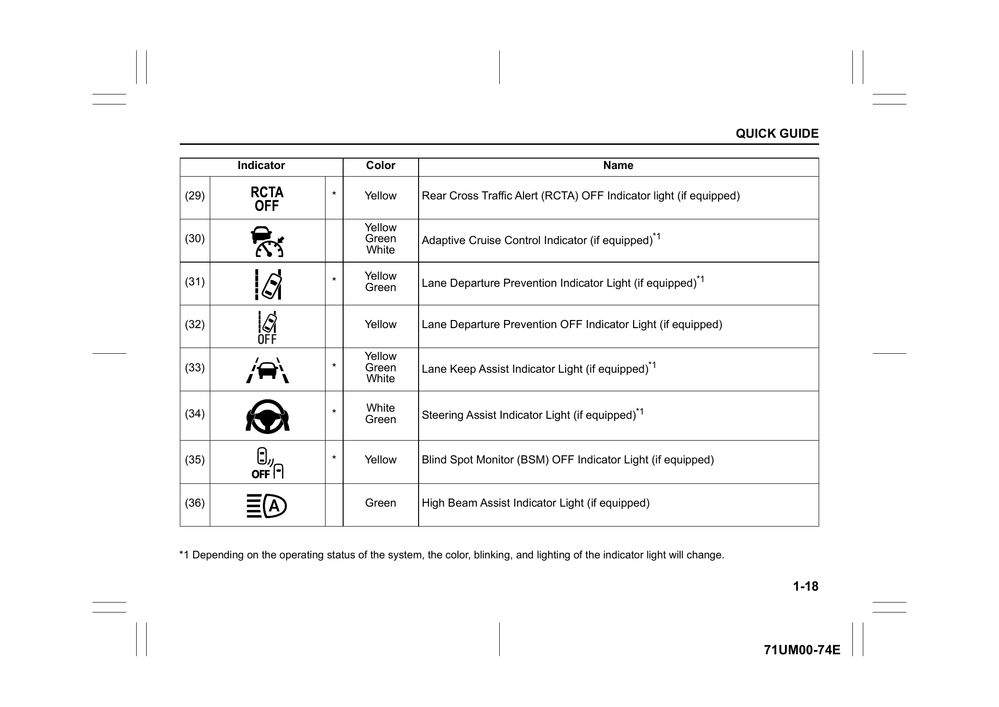
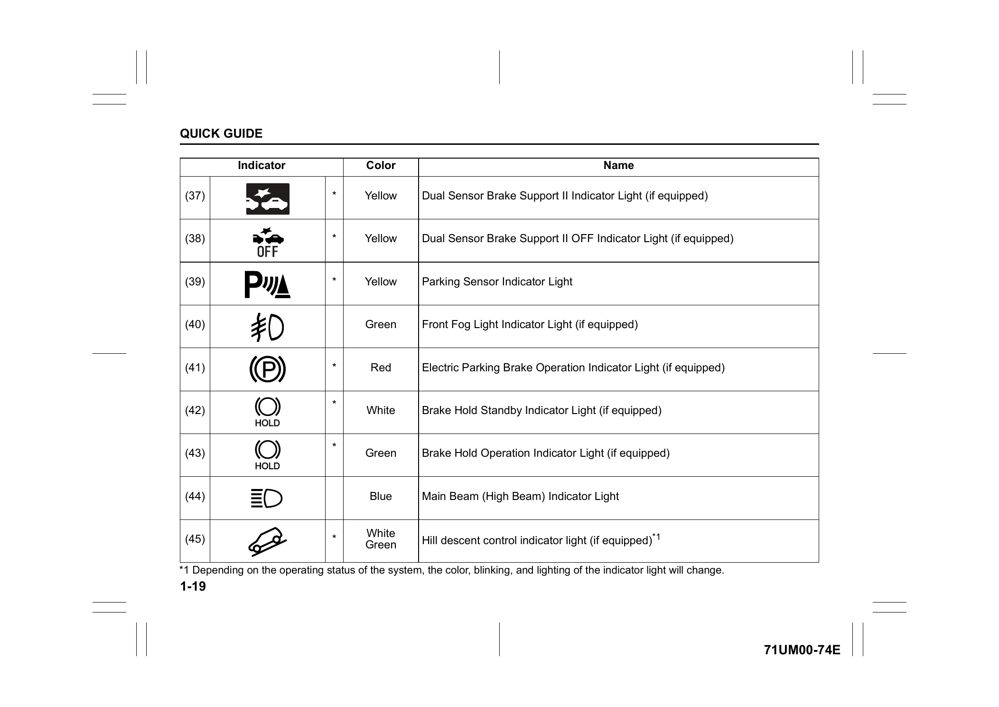
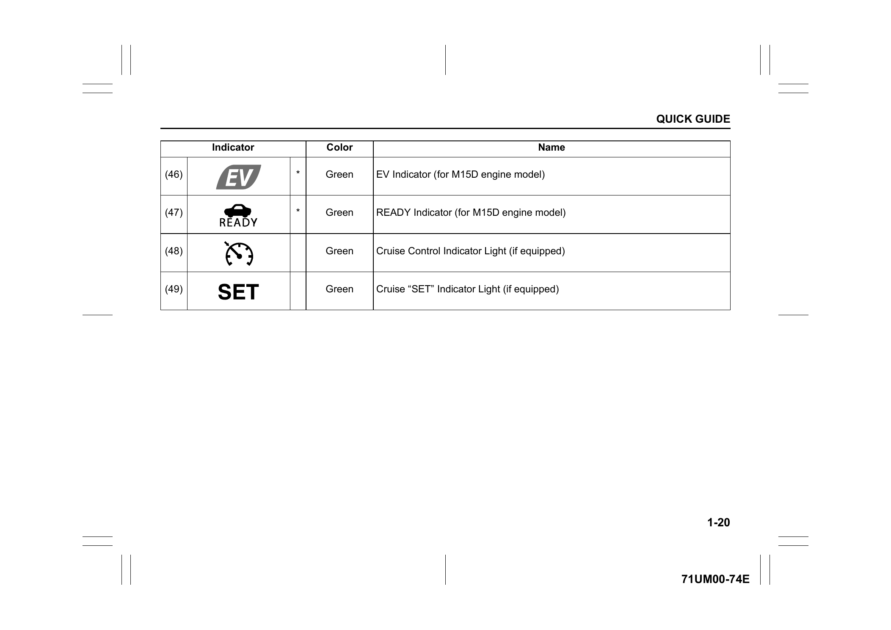

# Warning Lights and Indicators

## Warning Lights

Instrument cluster layout (Type B — fully digital TFT):

- If a warning light continues to be lit or is blinking, there may be a problem with the vehicle or the system. Carefully read the reference information below and consult a Maruti Suzuki authorised workshop.
- Warning lights and indicators marked with \* are lit when pressing the engine switch to change the ignition mode to ON. If such lights do not light up, consult a Maruti Suzuki authorised workshop.

## Indicators

Instrument cluster layout (Type B — fully digital TFT):

