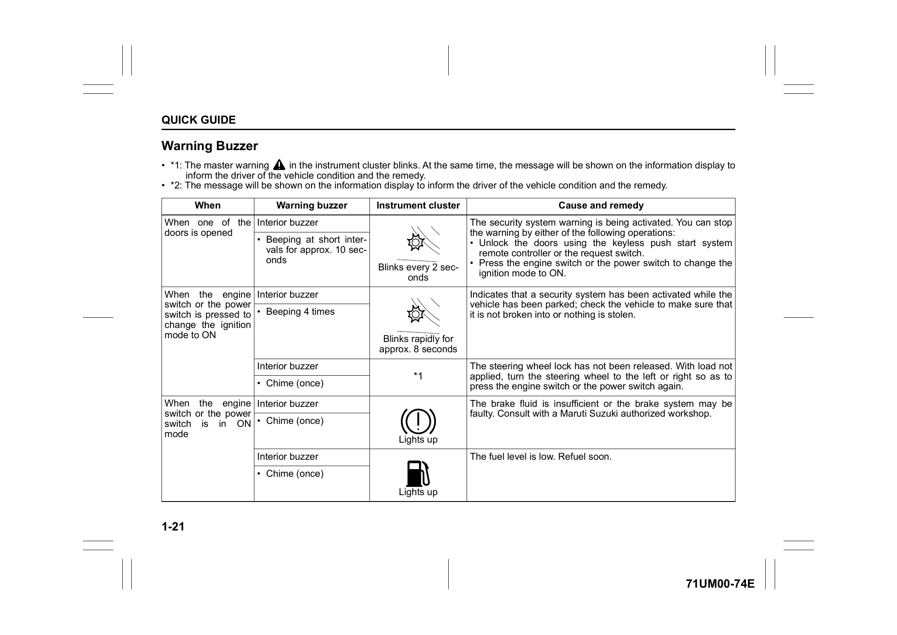
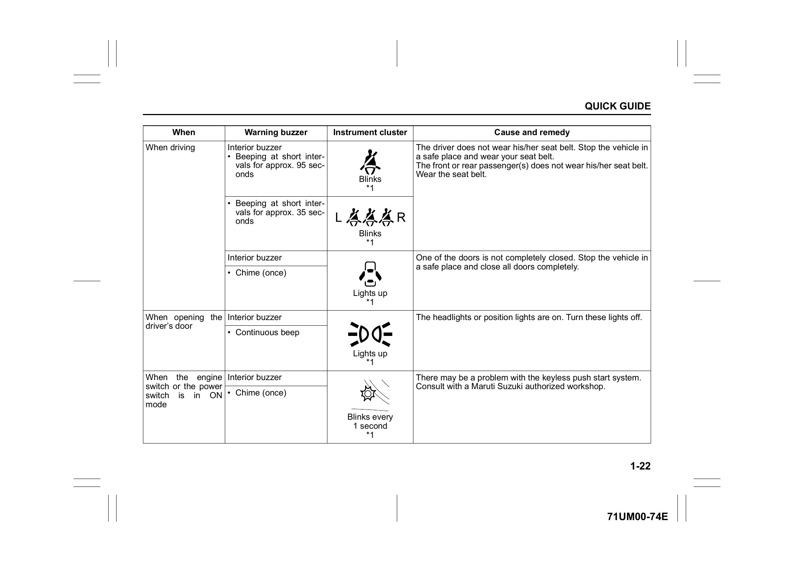
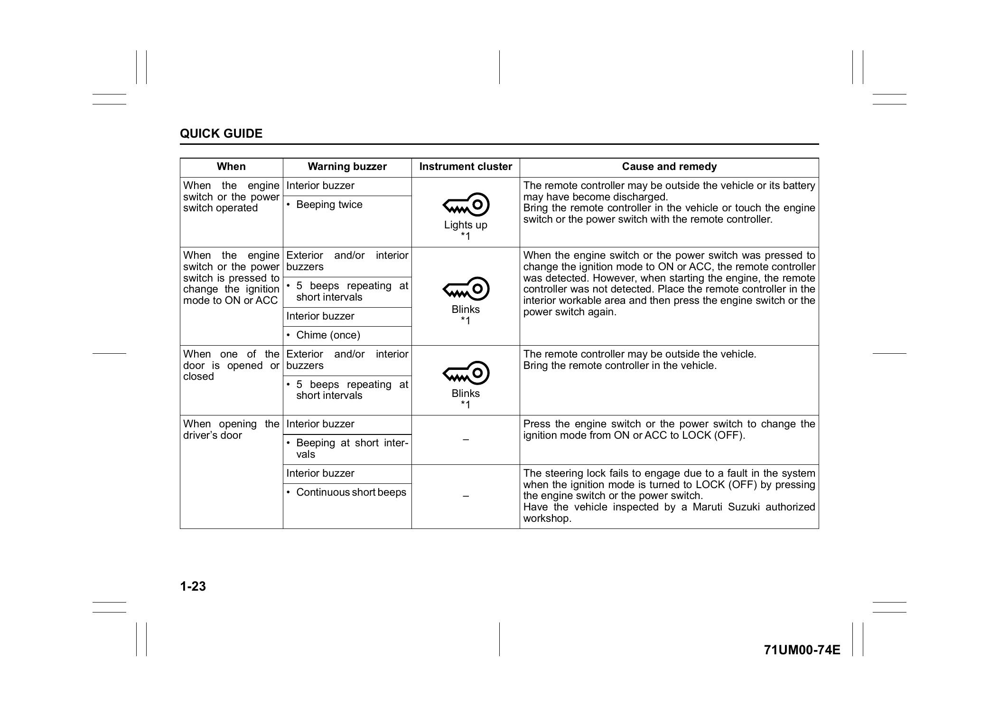
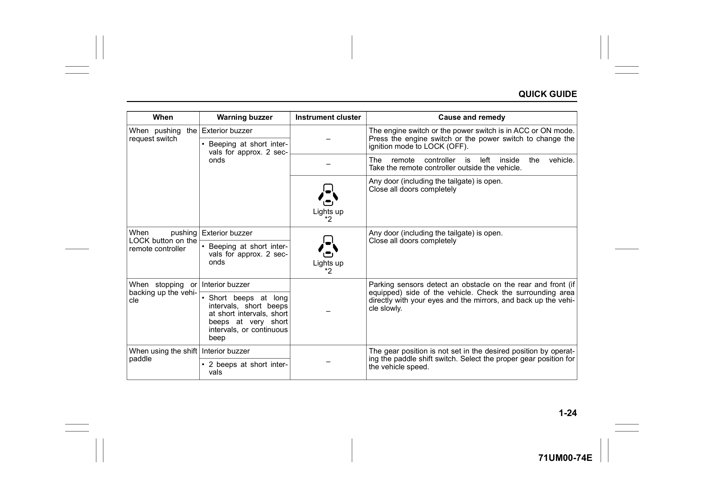
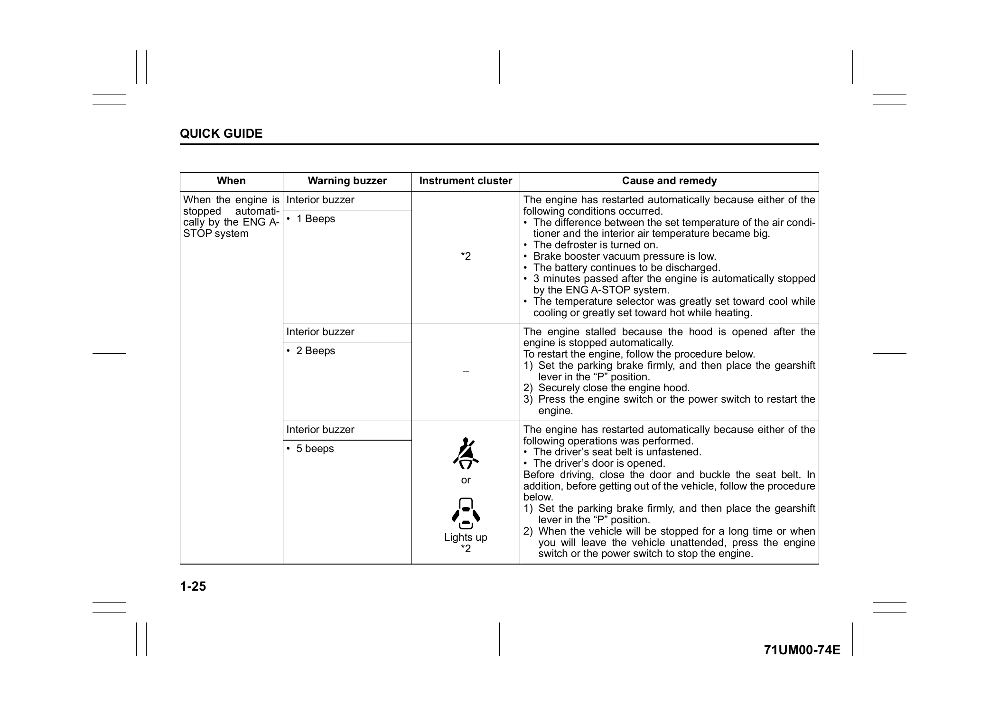
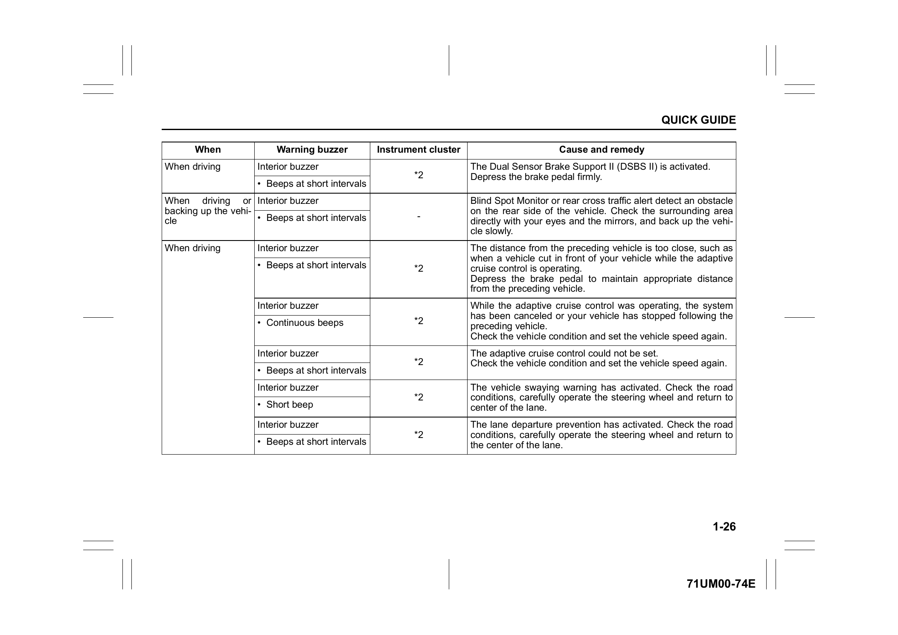
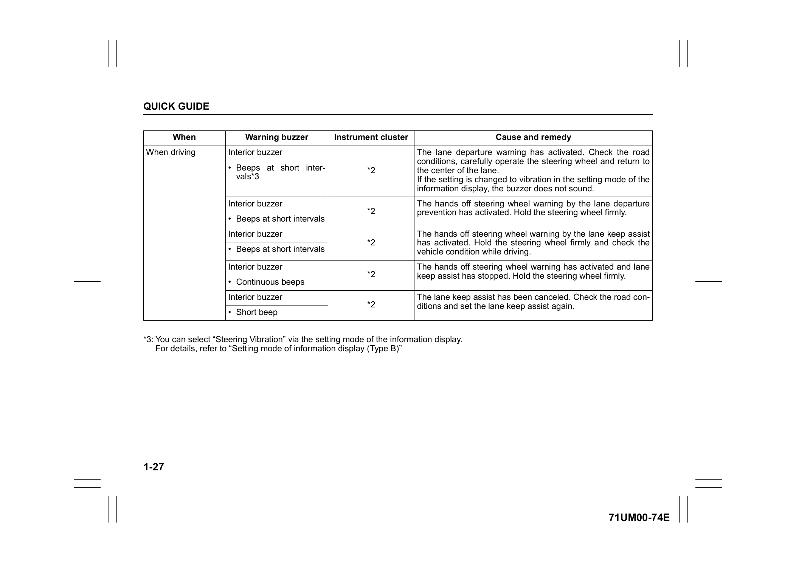
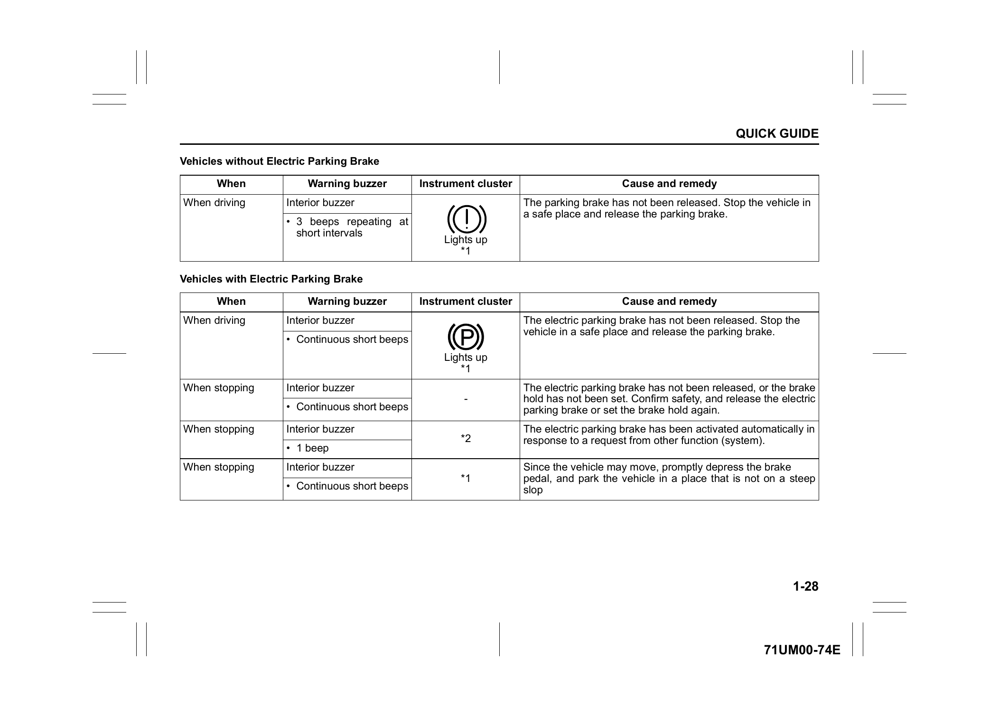

# Warning Buzzer

- \*1: The master warning indicator in the instrument cluster blinks. At the same time, a message is shown on the information display to inform the driver of the vehicle condition and the remedy.
- \*2: A message is shown on the information display to inform the driver of the vehicle condition and the remedy.

