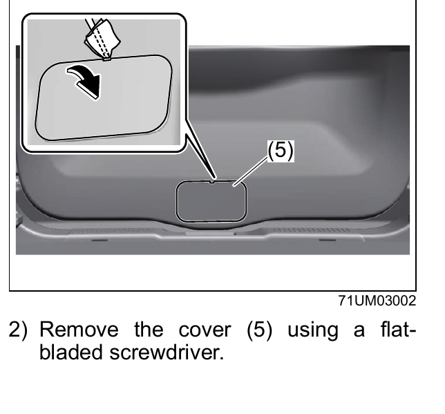
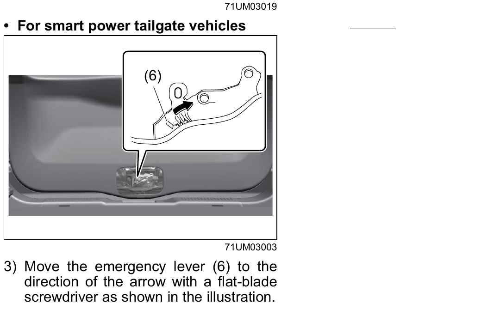

# Doors

> **WARNING:**
> - When a seat belt or luggage is caught by a door, the door cannot be shut properly and it may open while driving. This may cause an accident. Close a door so that no seat belt or luggage is caught in it.
> - When you keep the tailgate open with the engine running, exhaust gases will enter the vehicle and cause carbon monoxide poisoning. This may cause severe health problems or death. Do not keep the tailgate open with the engine running.
> - To prevent fire or theft, stop the engine and lock the doors when leaving the vehicle.
> - When opening a door, be careful of the surrounding area. Be very careful when opening a door especially on a windy day.

> **CAUTION:**
> - When a child opens or closes a door, their hands, legs or head may be caught in the door and this may cause injury. Opening or closing a door should be performed by an adult, not a child.
> - When the tailgate is not fully opened, it may be unexpectedly closed and this may cause injury. When opening the tailgate, open it fully.
> - Opening the tailgate right behind the exhaust pipes may cause burn injury. With the engine running, do not open the tailgate right behind the exhaust pipes.

> **NOTE:**
> - When leaving the vehicle even for a short period of time, do not leave cash or valuables in the vehicle, to avoid risk of theft.
> - Depending on the setting conditions of the security alarm and the opening conditions of the doors, an alarm may operate. Refer to [[03-04 Security System]] in this section.
## Side Door Locks
To lock a front door from outside the vehicle, insert the key and turn the top of the key toward the front of the vehicle, or turn the lock knob forward, then pull and hold the door handle as you close the door.

To unlock a front door from outside the vehicle, insert the key and turn the top of the key toward the rear of the vehicle.

To lock a door from inside the vehicle, turn the lock knob forward. Turn the lock knob rearward to unlock the door.

To lock a rear door from outside the vehicle, turn the lock knob forward and close the door. You do not need to pull and hold the door handle as you close the door.

> **NOTE:** Be sure to hold the door handle when you close a locked front door, or the door will not remain locked.
## Central Door Locking System
You can lock and unlock all doors (including the tailgate) simultaneously by using the key in the driver's door lock.

To lock all doors simultaneously, insert the key in the driver's door lock and turn the top of the key toward the front of the vehicle once.

To unlock all doors simultaneously, insert the key in the driver's door lock and turn the top of the key toward the rear of the vehicle twice.

To unlock the driver's door only, insert the key in that door lock and turn the top of the key toward the rear of the vehicle once.

You can also lock or unlock all doors by pressing the front or rear of the power door locking switch, respectively.

> **NOTE:** You can switch the function that unlocks all doors from requiring two turns/presses to requiring one, and vice versa, via the information display setting mode. Refer to [[12-19 Setting Mode of Information Display (Type B)]] in the "Specifications" section.

> **NOTE:** You can also lock or unlock all doors by operating the remote controller, or by pushing the request switch. Refer to [[03-03 Keyless Push Start System Remote Controller]] in this section.
## Child-proof Locks (Rear Doors)
Each rear door is equipped with a child-proof lock to help prevent unwanted opening from inside. When the lock lever is in the lock position, the rear door can only be opened from outside. When in the unlock position, the rear door can be opened from inside or outside.

> **WARNING:** Be sure to place the child-proof lock in the lock position whenever children are seated in the rear.

> **NOTE:** When you open a door from inside with the child-proof lock engaged, put your hand out of the window and use the door handle.
## Tailgate
### Locking and Unlocking from Outside
You can lock and unlock the tailgate by using the key in the driver's door lock.

To open the tailgate, push and hold the tailgate unlatch switch and lift the tailgate.

> **NOTE:** When the tailgate is closed incompletely, push the tailgate unlatch switch, open the tailgate, then close it again and check that it is fully closed.

> **WARNING:** Always ensure that the tailgate is closed and latched securely. Completely closing the tailgate helps prevent occupants from being thrown from the vehicle in an accident and helps keep exhaust gases from entering the vehicle.

> **WARNING:**
> - Make sure that the tailgate is fully closed before driving. If the tailgate is not fully closed, it may open unexpectedly while driving and hit nearby objects, or luggage in the luggage compartment may be thrown out, causing an accident.
> - Do not allow children to play in the luggage compartment.
> - Keep the tailgate closed while driving.
> - Never let anyone sit in the luggage compartment.
> - When opening or closing the tailgate, thoroughly check that the surrounding area is safe.
> - Use caution when opening or closing the tailgate in windy weather as it may move abruptly.
> - Do not pull on the tailgate spindle to close the tailgate, and do not hang on it.
> - When closing the tailgate, take extra care to prevent your fingers from being caught.
> - The tailgate may suddenly shut if it is not opened fully while on a steep incline. Make sure that the tailgate is secured before using the luggage compartment.

> **CAUTION:** To avoid damage and malfunction of the damper stay, do not scratch the rod part of the damper stay, do not allow foreign materials such as dirt or tape to attach to it, and do not hang any objects on it.
### Unlocking from Inside the Vehicle
If you cannot unlock the tailgate using the key in the driver's door lock due to a discharged battery or malfunction, reach out to a Maruti Suzuki authorised workshop. In an emergency, follow the procedure below.

1. Remove the luggage compartment cover (if equipped) and fold the rear seat forward for easier access. Refer to [[02-06 Rear Seats]] in the "For Safe Driving" section.
2. Remove the cover (5) using a flat-bladed screwdriver.

3. Move the emergency lever (6) in the direction of the arrow with a flat-blade screwdriver as shown in the illustration.

4. Push open the tailgate from inside. The tailgate will be latched again by simply closing it.

> **NOTE:** If you release the lever immediately after unlatching, the tailgate will be half-shut. Push open the tailgate while pulling the lever. If the tailgate cannot be unlatched, have the vehicle inspected by a Maruti Suzuki authorised workshop.

> **CAUTION:**
> - Do not touch the edges of the holes of the tailgate when you pull or push the lever, as this may cause injury.
> - Check that there is no one near the tailgate when pushing it open from inside the vehicle.
### Opening and Closing the Tailgate (Smart Power Tailgate)
#### Using the Remote Controller
Press and hold the tailgate button (3) on the remote controller. The smart power tailgate automatically opens/closes.

Pressing the button while the tailgate is opening/closing stops the operation. Pressing and holding again during the halted operation reverses the direction.

> **NOTE:** This function works only when the ignition is off.
#### Using the Smart Power Tailgate Switch (Instrument Panel)
Unlock the tailgate before operating. Press and hold the switch (1) on the instrument panel. The smart power tailgate automatically opens/closes.

Pressing the switch while operating stops the operation. Pressing and holding again during the halted operation reverses the direction.

> **NOTE:** If the security system is armed, use either the request switch or remote controller to unlock the tailgate before operating.
#### Using the Switches on the Tailgate
To open: Unlock the tailgate before operating. Press the switch (1) on the upper part of the tailgate. The smart power tailgate automatically opens.

To close: Press the switch (2) on the lower part of the tailgate. The smart power tailgate automatically closes. Pressing the switch while operating stops the operation; pressing again reverses the direction.

> **NOTE:** If the security system is armed, use either the request switch or remote controller to unlock the tailgate before operating.
#### Using the Tailgate Handle
Lower the tailgate using the tailgate handle (3). The tailgate closing assist will activate and the smart power tailgate will fully close automatically.
#### Using Gesture Control
1. While carrying the remote controller, stand within the request switch operation range from the rear bumper.
2. Perform a kick operation by moving your foot to within approximately 10 cm of the rear bumper and then pulling it back. Perform the entire kick operation within 1 second.
3. When the gesture control detects that your foot is pulled back, a buzzer will sound and the tailgate will automatically fully open/close.

If a foot is moved under the rear bumper while the tailgate is opening/closing, the tailgate will stop. Moving your foot under the bumper again reverses the direction.

> **WARNING:**
> - Check the safety of the surrounding area before operating.
> - When putting your foot near the lower centre part of the rear bumper, be careful not to touch the exhaust pipes until they have cooled down sufficiently.
> - Do not leave the remote controller within the effective detection range of the luggage compartment.
### Gesture Control Operating Conditions
The gesture control will open/close automatically when all of the following conditions are met:
- The gesture control operation is enabled.
- The remote controller is within the operational range.
- A foot is put near the lower centre part of the rear bumper and moved away from it.

The smart power tailgate may also be operated by putting a hand, elbow, knee, etc. near the lower centre part of the rear bumper and moving it away.
### Situations Where Gesture Control May Not Operate Properly
- A foot remains under the rear bumper.
- The rear bumper is strongly hit or touched for a while (wait a short time before trying again).
- Someone is too close to the rear bumper during operation.
- An external radio wave source interferes with communication between the remote controller and vehicle.
- The vehicle is parked near an electrical noise source (pay parking, fuel station, electrically heated road, fluorescent light).
- The vehicle is near a TV tower, power plant, radio station, large electronic display, airport, or other facility generating strong radio waves.
- A large volume of water is applied to the rear bumper (car wash, heavy rain).
- Mud, snow, ice, etc. is attached to the rear bumper.
- The vehicle has been parked near moving objects that may contact the rear bumper (plants, shrubs).
- An accessory is installed to the rear bumper. If an accessory has been installed, turn the gesture control operation setting off. Contact a Maruti Suzuki authorised workshop to do so.
### Preventing Unintentional Operation of Gesture Control
When a remote controller is in the operation range, the gesture control may operate unintentionally in these situations:
- Large volume of water applied to the rear bumper (car wash, heavy rain).
- Wiping dirt off the rear bumper.
- A small animal or object rolling under the rear bumper.
- An object dragged from under the rear bumper.
- Someone swinging their legs while sitting on the rear bumper.
- Legs or body parts contacting the rear bumper while passing by.
- Nearby electrical noise sources (pay parking, fuel station, electrically heated road, fluorescent light, TV tower, power plant, radio station).
- Objects such as plants or shrubs near the rear bumper.
- Luggage or objects set near the rear bumper.
- Accessories or a vehicle cover installed/removed near the rear bumper.
- When the vehicle is being towed.

To prevent unintentional operation, turn the "PWR DOOR OFF" switch off to disable the smart power tailgate system.
### Gesture Control Precautions

> **NOTICE:**
> - Keep the lower centre part of the rear bumper clean at all times. If dirty or covered with snow, clean it, move the vehicle from the current position, and check if the gesture control operates. If it does not operate, have the vehicle inspected by a Maruti Suzuki authorised workshop.
> - Do not apply hydrophilic coatings or other coatings to the lower centre part of the rear bumper.
> - Do not park the vehicle near objects that may move and contact the lower centre part of the rear bumper (e.g. grass or plants). If this occurs, move the vehicle and re-check gesture control operation.
> - Do not subject the gesture control or its surrounding area to strong impacts. If impacted, have the vehicle inspected.
> - Do not disassemble the rear bumper.
> - Do not attach stickers to the rear bumper.
> - Do not paint the rear bumper.
> - If a bicycle carrier or similar heavy object is attached to the smart power tailgate, turn the gesture control operation setting off. Contact a Maruti Suzuki authorised workshop.
> - When the tailgate is opened using the remote controller or gesture control while the security system is armed, the tailgate will lock automatically and the security system will be re-armed once it is closed.
> - Before leaving the vehicle, ensure all doors are locked.
### Canceling the Smart Power Tailgate System
Turn the "PWR DOOR OFF" switch off to disable the smart power tailgate system. When the system is off, the tailgate does not operate automatically but can be opened and closed by hand.
### Adjusting the Open Position
The open position of the smart power tailgate can be adjusted.

1. Stop the tailgate in the desired position.
2. Press and hold the switch (1) on the lower part of the tailgate for approximately 2 seconds. When the settings are completed, the buzzer sounds 4 times.

When opening the tailgate next time, it will stop at the adjusted position.

To cancel the adjusted position: Press and hold the switch (1) on the lower part of the tailgate for approximately 7 seconds. After the buzzer sounds 4 times, it sounds 3 more times. The tailgate will return to the initial settings position on the next open operation.
### Jam Protection Function
Sensors are equipped on both sides of the smart power tailgate. If anything obstructs the smart power tailgate while it is closing, the tailgate will automatically operate in the opposite direction and stop.

> **WARNING:**
> - Never use any part of your body to intentionally activate the jam protection function.
> - The jam protection function may not work if something gets caught just before the tailgate fully closes. Be careful to keep fingers and other objects clear.
> - The jam protection function may not work depending on the shape of the object that is caught.
### Fall-Down Protection Function
While the smart power tailgate is opening automatically, applying excessive force to it will stop the opening operation to prevent the tailgate from suddenly shutting.
### Tailgate Closing Assist
If the tailgate is lowered manually when stopped at an open position, the tailgate will fully close automatically.

> **WARNING:** In the event the tailgate is left slightly open, the tailgate closer will automatically close it to the fully closed position. It takes several seconds before the tailgate closure begins to operate. Ensure that fingers or any body parts/clothes do not get stuck, as this may cause serious injuries.
### Smart Power Tailgate Operating Conditions
The smart power tailgate can automatically open and close under the following conditions:
- The smart power tailgate system is "ON".
- When the ignition mode is "ON", and additionally for opening: vehicle speed is 5 km/h or less and the parking brake is engaged, or the brake pedal is depressed, or the shift lever is in P.
### Tailgate Spindle Precautions

> **NOTICE:** The tailgate is equipped with spindles that hold it in place. Do not attach any foreign objects such as stickers, plastic sheets, or adhesives to the spindle rod. Do not attach any accessories other than genuine Maruti Suzuki parts to the tailgate. Do not place your hand on the spindle or apply lateral forces to it.
### When Reconnecting the Battery or Changing a Fuse While the Tailgate Is Open
To enable the smart power tailgate to operate properly, initialize the system by completely closing the tailgate manually. If the battery is reconnected or a fuse is changed while the tailgate is closed, initializing the system is not necessary.
