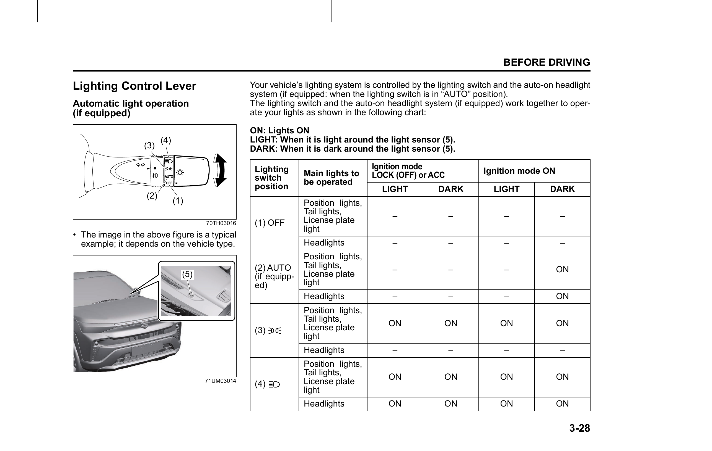

# Lighting Control Lever
Your vehicle's lighting system is controlled by the lighting switch and the auto-on headlight system (when the lighting switch is in the "AUTO" position). They work together to operate your lights as shown in the chart below.

To turn the lights on or off, twist the knob on the end of the lever.

## Switch Positions
**OFF (1):** All lights are off.

**AUTO (2):** The position lights, tail lights, license plate light and headlights are turned on and off automatically according to the amount of outside light detected by sensor (5) on the passenger's side of the instrument panel. This function operates when the ignition mode is ON. All lights go out automatically when the ignition mode is changed to ACC or LOCK (OFF).

**Position (3):** Front position lights, tail lights, license plate light, and instrument lights are on. Headlights are off.

**Headlights (4):** Front position lights, tail lights, license plate light, instrument lights, and headlights are all on.

With the headlights on, push the lever forward to switch to high beams and pull it toward you to switch to low beams. When the high beams are on, a light on the instrument cluster will illuminate. To momentarily activate the high beams as a passing signal, pull the lever slightly toward you and release it.

> **CAUTION:** If the light sensor area of the windshield is covered with mud, ice, or similar substances, the headlights and position lights may be turned on even when it is still light outside.

> **NOTE:**
> - Avoid covering the light sensor area of the windshield with a sticker, as it may impair the sensor's performance.
> - If the ignition mode is ON and "AUTO" remains selected, headlights and position lights will come on automatically as it gets dark, even with the engine not running. Leaving the lights on for a long time may fully discharge the battery.
## Auto-On Headlight System
The auto-on headlight system automatically turns on all lights operated by the lighting switch when all three of the following conditions are met:
1. It is dark around the light sensor (5).
2. The lighting switch is in "AUTO" position.
3. The ignition mode is changed to ON.

Do not cover sensor (5). Otherwise, the system will not work correctly.

> **WARNING:** It takes about 5 seconds for the light sensor to react to a change in lighting conditions. To avoid reduced visibility accidents, turn on your headlights manually before driving into a tunnel, parking structure, etc.

> **NOTE:** The light sensor reacts to infrared rays and may operate incorrectly when there are strong infrared rays present.
## Light Reminder Buzzer
The interior buzzer continuously beeps if you open the driver's door without turning off the headlights and position lights. This is triggered when the headlights and/or position lights remain on after the ignition mode is changed to LOCK (OFF). A message is also displayed on the information display in the instrument cluster while the buzzer is sounding. The buzzer stops when you turn off the lights.
## Daytime Running Light (DRL) System
When the engine is started, the daytime running lights are turned on automatically.

**Conditions for DRL operation:**
1. The engine is running.
2. Headlights and front fog lights are off.

> **NOTE:**
> - The brightness of the daytime running lights is different from that of the position lights; this is not a malfunction.
> - When using the turn signal, the daytime running light on the signalling side goes off.
## Guide Me Light
Guide Me Light has two functions — "To home" and "To car" — for improving visibility in the dark.
### "To Home" Function
After leaving the car, the ground will be illuminated for a short while. The front position lights and headlights (low beam) turn on for about 10 seconds after the ignition mode is changed to LOCK (OFF).

**To activate:**
1. Turn the lighting switch to "AUTO" position.
2. Change the ignition mode to LOCK (OFF).
3. Pull the lighting control lever toward you once and open the driver's side door within 60 seconds. Alternatively, pull the lighting control lever toward you once while the driver's side door is already open.

**To cancel:**
- Pull the lighting control lever toward you once, or
- Change the ignition mode to ACC or ON, or
- Turn the lighting switch to any position other than "AUTO".

> **NOTE:**
> - When the "To home" function is active, the front fog lights and high beam headlights are not turned on.
> - The lighting time can be changed in the information display. Refer to [[04-02 Information Display (Type B)]] in the "Instrument Cluster" section.
### "To Car" Function
Before you get in the vehicle, the ground is illuminated to guide you to the car in the dark. When the UNLOCK button on the keyless push start system remote controller is pressed with the lighting switch in "AUTO" position, the front position lights and headlights (low beam) turn on for 10 seconds.

This function only operates when it is dark outside the vehicle.

**To cancel:**
- Lock the doors using the keyless push start system remote controller, request switch, or the key in the driver's door lock, or
- Change the ignition mode to ACC or ON.

> **NOTE:**
> - When the "To car" function is active, the front fog lights and high beam headlights are not turned on.
> - The lighting time can be changed in the information display. Refer to [[04-02 Information Display (Type B)]] in the "Instrument Cluster" section.
## Front Fog Light Switch
Refer to [[07-00 Other Controls and Equipment]] for the Front Fog Light Switch.
