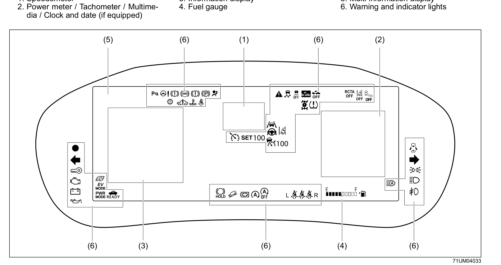
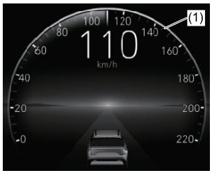
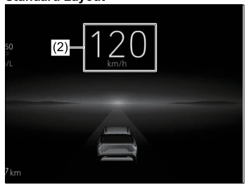
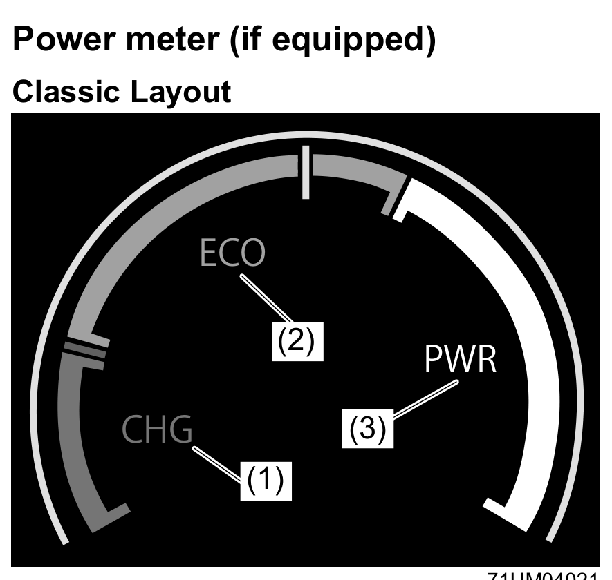
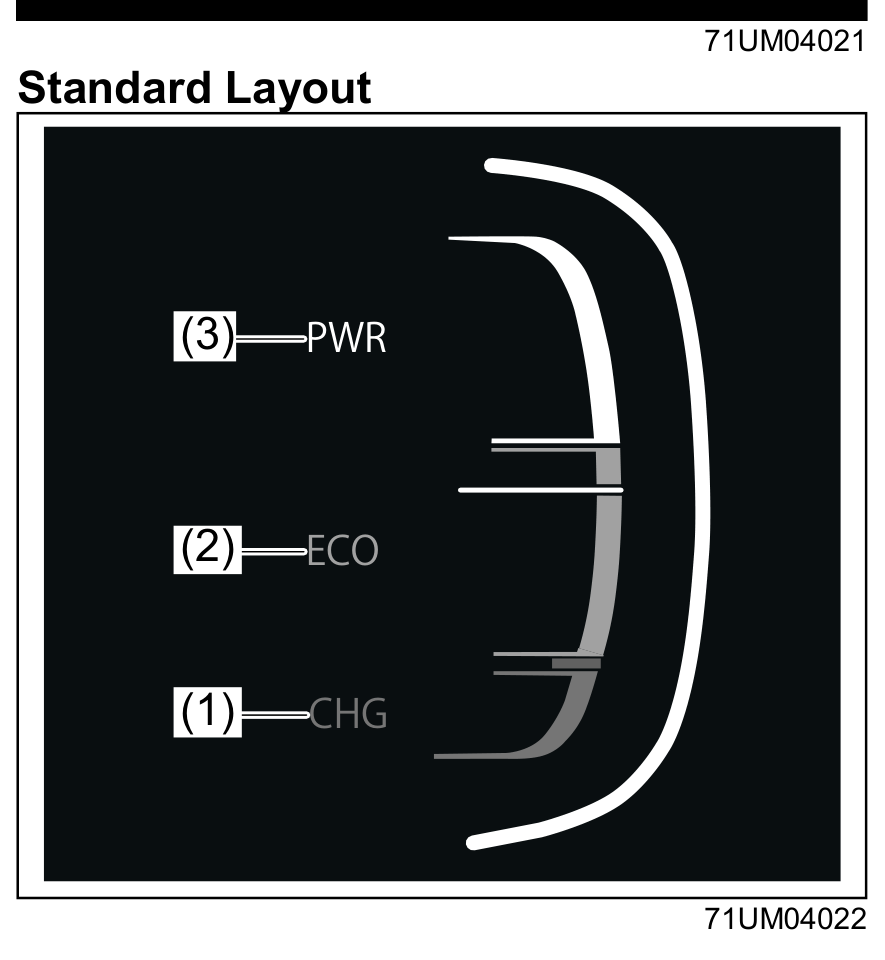
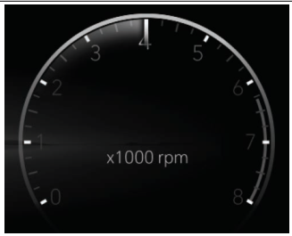
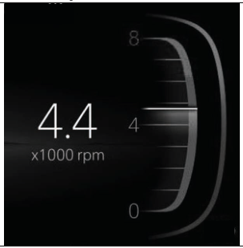
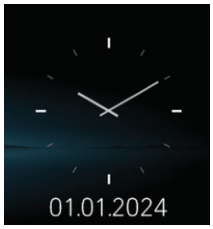
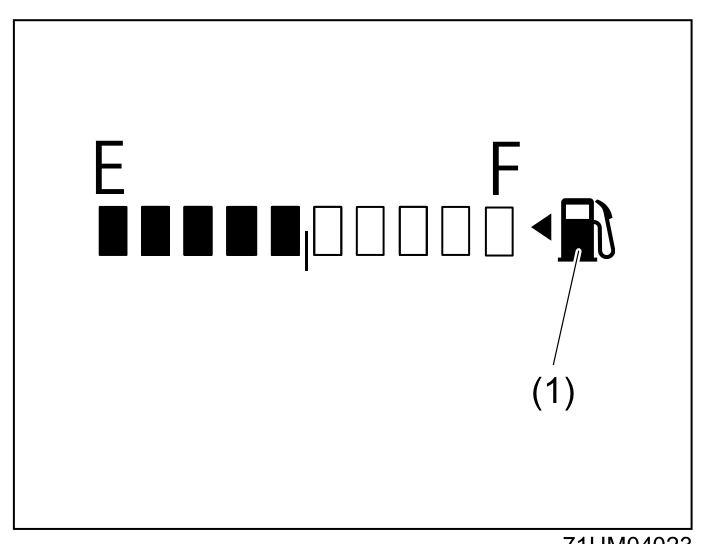
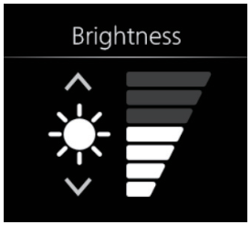

# Instrument Cluster (Type B)

The Type B instrument cluster is a fully digital TFT display. Its six main areas are:
1. Speedometer
2. Power meter / Tachometer / Multimedia / Clock and date
3. Information display
4. Fuel gauge
5. Multi-information display
6. Warning and indicator lights

## Speedometer
The speedometer indicates vehicle speed. You can switch between Classic and Standard layout from the Setting Mode in the information display.

**Classic Layout**

**Standard Layout**

### Speed Alert System
The speed alert system gives an audible warning when you exceed set speed thresholds. There is no malfunction implied by this buzzer.

| Speed threshold | Alert |
|---|---|
| Exceeds ~80 km/h | Two beeps every minute (primary level) |
| Exceeds ~120 km/h | Continuous beeps (secondary level) |
| Slows to ~118 km/h | Returns to primary (two beeps) |
| Slows to ~78 km/h | Alert stops |

## Power Meter
The power meter occupies the same display zone as the tachometer on non-SHVS vehicles. It shows three areas:

| Area | Label | Meaning |
|---|---|---|
| (1) | CHG | Regeneration is active — kinetic energy is charging the hybrid battery |
| (2) | ECO | Driving in an eco-friendly manner |
| (3) | PWR | Eco-friendly range is being exceeded (full-power driving) |

> **NOTE:** "Regeneration" refers to the conversion of vehicle movement energy into electrical energy.
> The power meter does not illuminate when the shift position is in a range other than D, B, or R.

**Classic Layout**

**Standard Layout**

## Tachometer (if equipped)
On non-SHVS variants, the tachometer occupies the same zone as the power meter and indicates engine speed in revolutions per minute.

> **NOTICE:** Never drive with the engine revving in the red zone — severe engine damage can result. Keep engine speed below the red zone even when downshifting.

**Classic Layout**

**Standard Layout**

## Multimedia (if equipped)
When selected, this zone displays multimedia information such as Bluetooth, USB, Apple CarPlay, or Android Auto. Refer to the infotainment system manual for details.

## Clock and Date
The clock displays in zone (F) of the information display. To set the time or date, follow the Setting Mode instructions in the [[04-02 Information Display (Type B)]] section.

## Fuel Gauge
When the ignition mode is ON, the fuel gauge shows the approximate amount of fuel remaining. "F" = Full, "E" = Empty. The fuel filler door is on the **left** side of the vehicle (indicated by the arrow mark).

If the indicator approaches "E", refill the tank as soon as possible. The low fuel warning light will come on when approximately 5.0 L or less remains — see [[04-03 Warning and Indicator Lights]].

> **NOTICE:** Avoid driving near empty — this risks damage to the catalytic converter and other components.
> **NOTE:** The indicator may move slightly on slopes or curves due to fuel movement in the tank.

## Brightness Control
The instrument panel lights come on when the ignition mode is ON. You can adjust brightness even when the ignition mode is LOCK (OFF).

**To adjust brightness:**
1. Press **<** or **>** on the left/right selector switch (3) to navigate to Setting Mode.
2. Press the up/down selector switch (1) **∧** or **∨** to select the Brightness option, then press the switch (2) to confirm.
3. Press **∧** or **∨** again to adjust the brightness level.
4. Press **<** on the left selector switch (3) to exit.

> **WARNING:** Do not adjust brightness while driving — you could lose control of the vehicle.
> **NOTE:** When the lead-acid battery is reconnected, brightness resets to default. Readjust to your preference.
> **NOTE:** At maximum brightness with position lights or headlights on, the auto-dimming function and all brightness control functions (except maximum) are cancelled.
