# Information Display (Type B)

The information display is shown when the ignition mode is ON. It is divided into labelled zones (A) through (K).

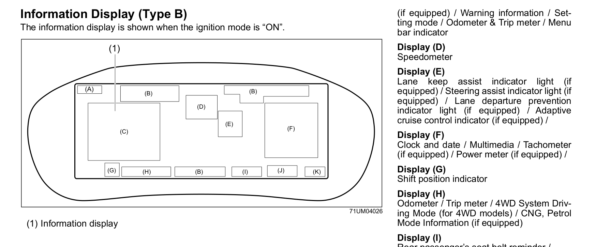

| Zone | Content |
|---|---|
| (A) | Clock |
| (B) | Warning and indicator lights |
| (C) | Driving information / warning messages / setting mode / odometer & trip / menu bar |
| (D) | Speedometer |
| (E) | Lane keep assist / steering assist / lane departure prevention / adaptive cruise control indicators |
| (F) | Clock and date / Multimedia / Power meter |
| (G) | Shift position indicator |
| (H) | Odometer / Trip meter |
| (I) | Rear passenger seat belt reminder / outside temperature |
| (J) | Fuel gauge |
| (K) | Driving range |

## Navigating the Display
Use the steering wheel selector switches to operate Display (C).

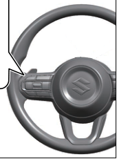

| Switch | Action |
|---|---|
| Left/right selector (3) **<** or **>** | Change menu bar tab |
| Up/down selector (1) **∧** / **∨** | Select screen within tab |
| OK switch (2) | Confirm selection or reset values |

The menu bar in Display (C) has five tabs:

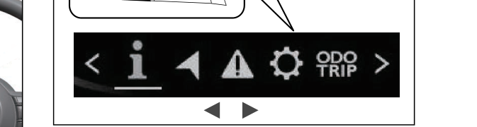

| Tab | Icon | Content |
|---|---|---|
| (a) | i | Driving information display |
| (b) | ◄ | Navigation information (if infotainment is active) |
| (c) | ▲ | Warning message display |
| (d) | ⚙ | Setting mode |
| (e) | ODO/TRIP | Odometer / Trip meter display |

> **WARNING:** Do not adjust the display while driving — you could lose control of the vehicle.

## Display (C) — Driving Information

The driving information tab (a) shows the following screens. Select with the up/down switch.

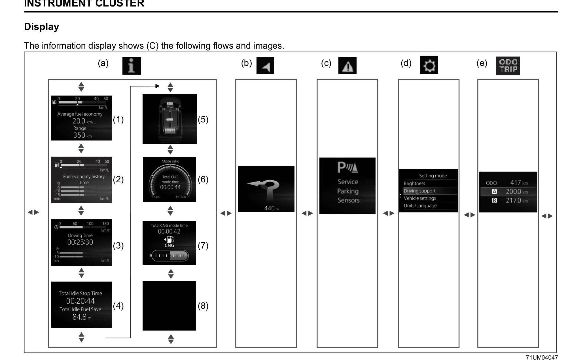

### Instantaneous Fuel Consumption / Average Fuel Economy / Range
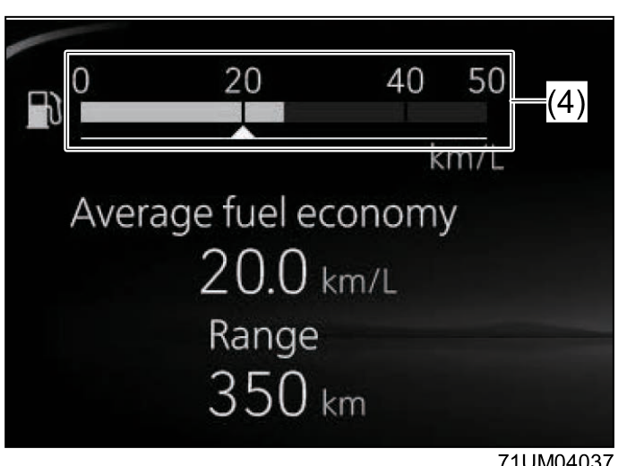

The bar graph shows instantaneous fuel consumption only when the vehicle is moving. Units are km/L or L/100km (changeable in Setting Mode). Maximum displayed value is 50 km/L or 30 L/100km.

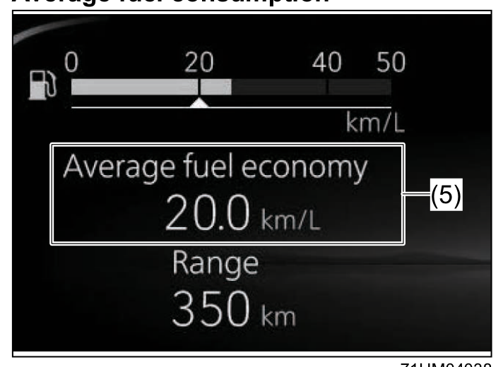

Average fuel consumption from the previous reset is shown. If you selected this view on the last drive, the previous value is shown on startup until you drive for a short period. You can set when the value resets:
- **Reset after refuel** — resets automatically when you fill up
- **Reset with trip meter A** — resets automatically when trip meter A is reset
- **Reset manually** — press OK switch (2) while this screen is displayed

### 1-Driving Cycle Fuel Consumption
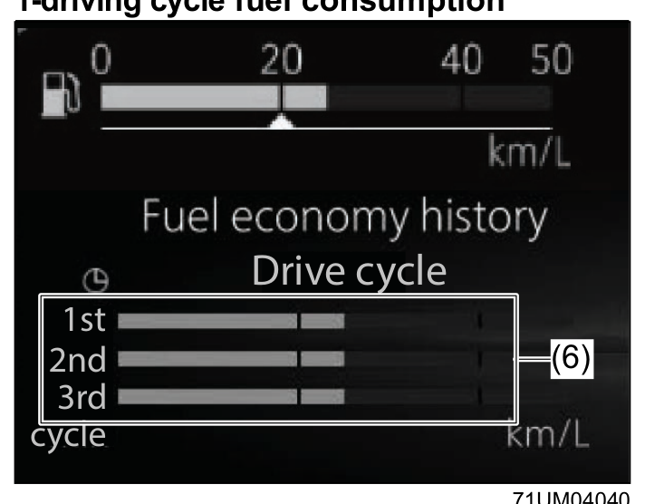

Shows average fuel consumption for the current and past 3 driving cycles.

### 5-Minute Average Fuel Consumption
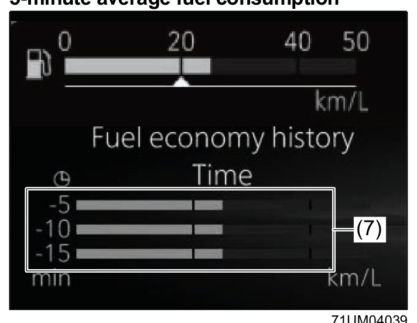

Shows transition of average fuel consumption every 5 minutes, from 15 minutes ago up to now.

### Driving Range
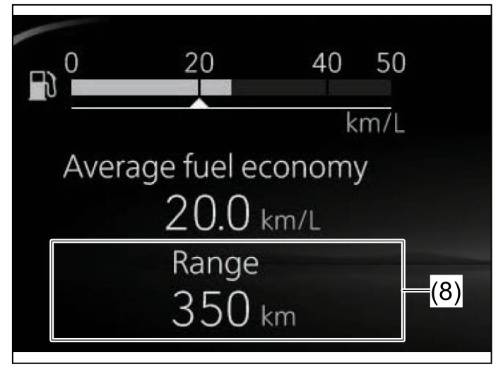

Shows the approximate distance you can drive before the fuel gauge reaches "E", based on current conditions. Displays "---" when the low fuel warning light is on — refuel immediately regardless of the range shown. If you refuel with the ignition ON, the value may not update correctly.

### Average Speed / 5-Minute Average Speed
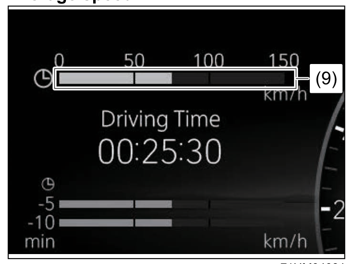
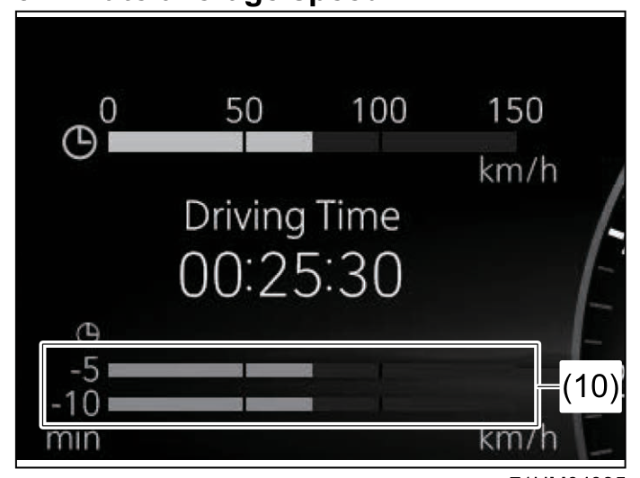

Press OK switch (2) while average speed is displayed to reset it.

### Driving Time
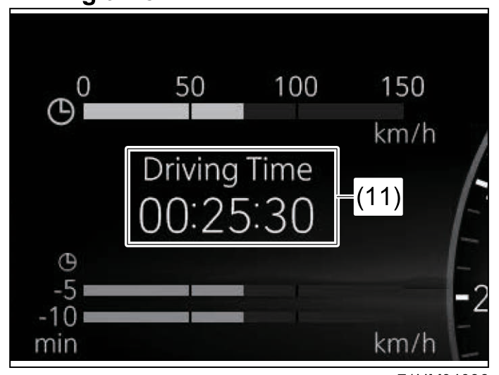

Shows cumulative driving time since last reset. Maximum displayed value is 99:59:59. Press OK switch (2) to reset. Reconnecting the battery also resets this value.

### Total Idle Stop Time and Total Idle Fuel Saved
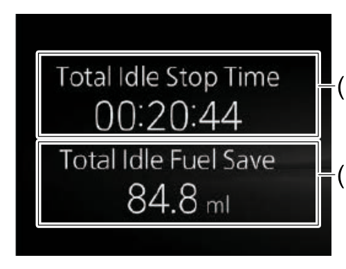

Shows the total engine-off time (hh:mm:ss) and total fuel saved (ml) by the ENG A-STOP system since last reset. Press OK switch (2) to reset. Maximum displayed idle stop time is 99:59:59. Reconnecting the battery resets both values.

### Energy Flow
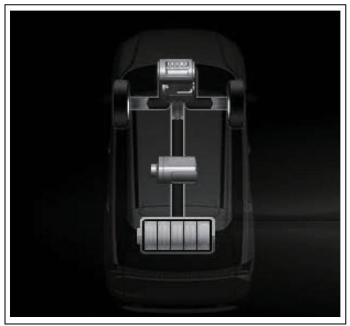

Shows the current SHVS energy flow status. See [[05-12 SHVS]] for details on status lamp meanings.

### Intersection Guidance
When Android Auto or Apple CarPlay is active on the infotainment system, the display shows turn-by-turn direction and distance.

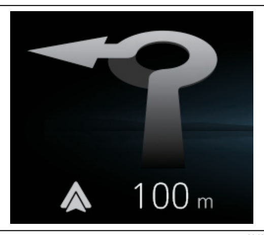
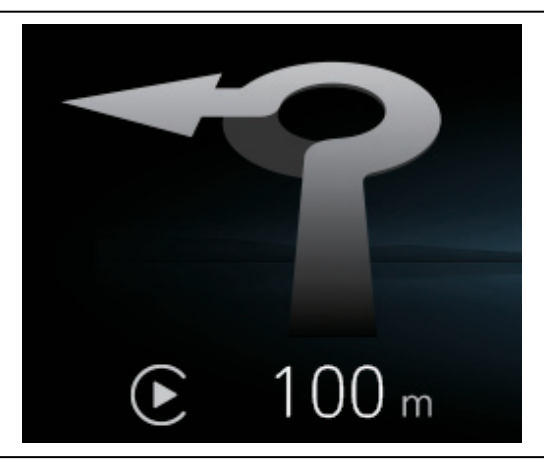

> **NOTE:** A slight time lag may occur between the information display guidance and the infotainment system. You can turn intersection guidance on or off while navigation is active.

## Trip Meter / Odometer

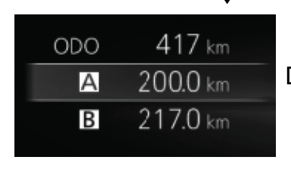

Display (H) shows the trip meter and odometer. Two independent trip meters (A and B) are available. Select "Odometer / Tripmeter display" from the menu bar to show in Display (C). To reset trip meter A or B, select it and press the OK switch until the display resets.

> **NOTICE:** Keep track of your odometer reading and check the maintenance schedule regularly. Increased wear or damage can result from missed services.

## Gear Position
Display (G) shows the current gear position when the ignition mode is ON.

See [[05-10 Using Transmission]] for details.

## Digital Speedometer Display
When the Classic or Standard analog speedometer layout is selected, you can toggle a digital speed readout on or off inside the speedometer area via Setting Mode.

## Information Shown After Driving
When the power switch is pressed to LOCK (OFF), the following summary appears on the information display for a few seconds:

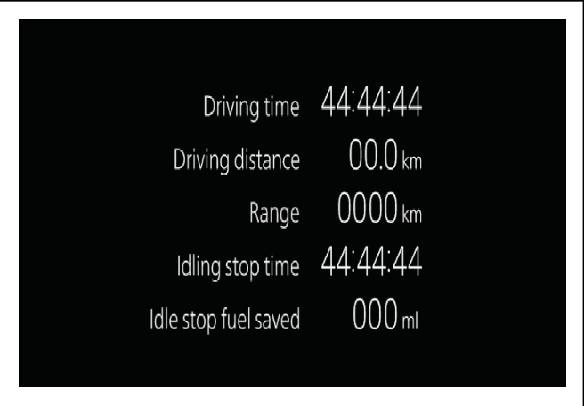

## Rear Passenger Seat Belt Reminder Light
Display (I) shows a reminder light when rear passengers have not fastened their seat belts. See [[02-09 Seat Belt]] for details.

## Setting Mode
Brightness, units, reset timing, speedometer layout, and other preferences are configured in Setting Mode (tab d). For a full list of customisable settings, refer to [[12-19 Setting Mode of Information Display (Type B)]] in the Specifications chapter.

## Warning and Indicator Messages

When the vehicle detects a problem, a warning or indicator message appears in Display (C). The master warning indicator light (zone B) may also blink. In some cases a buzzer sounds simultaneously.

- When the problem is resolved, the message disappears automatically.
- If multiple problems occur, their messages alternate every ~5 seconds.
- Press and hold OK switch (2) to temporarily dismiss a message.
- If a message persists, have the vehicle inspected at a Maruti Suzuki authorised workshop.

> **NOTE:** Additional warning messages related to ENG A-STOP, DSBS II, adaptive cruise control, lane departure prevention, BSM/RCTA, and parking sensors are described in their respective sections.

### Warning Messages Table

| Display | Master Warning Light | Sound | Cause and Remedy |
|---|---|---|---|
| 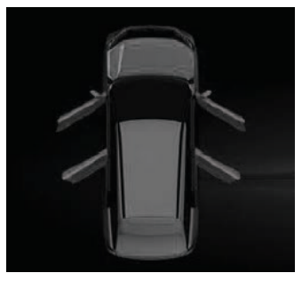 | Blinks (only while moving) | 1 beep (only while moving) | A door, tailgate, or engine hood is not properly closed. Stop safely and close it. |
| 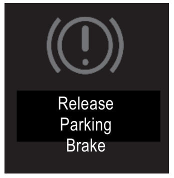 | Blinks | Continuous beep | The parking brake is not released. Stop safely and release it. |
| 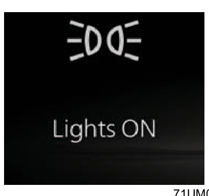 | Blinks | Continuous beep | Headlights and/or position lights are left on. Turn them off. |
| 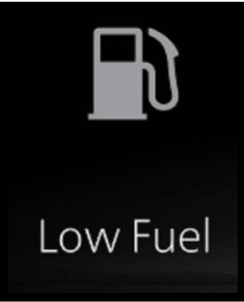 | Off | 1 beep | Fuel level is low. Refill as soon as possible. *(#1)* |
| 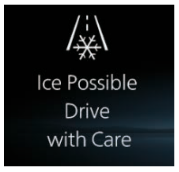 | Off | Off | The road may be icy. Drive very carefully. *(#1)* |
| 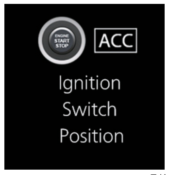 | Off | Off | ACC ignition mode is selected. *(#1)* |
| 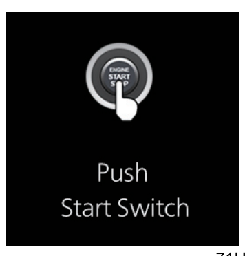 | Off | Off | Brake pedal is depressed — press the power switch to start the hybrid system. |
| 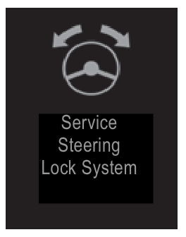 | Blinks | 1 beep | Steering lock is not disengaged. Lightly turn the steering wheel both ways and press the power switch again. |
| 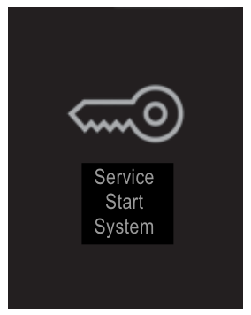 | Blinks | 1 beep | Problem with the immobilizer/keyless push start system, or battery voltage is low. If it persists at normal battery voltage, visit a Maruti Suzuki authorised workshop. |
| 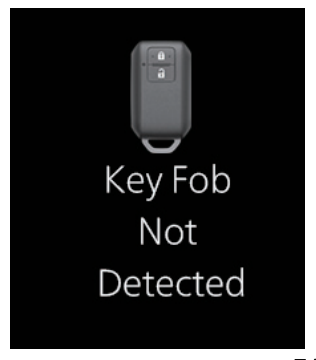 | Blinks | Series of beeps | Remote controller may be outside the vehicle or its battery is discharged. Bring it inside or touch the engine push start switch with it. Replace the battery if the message persists. |
| 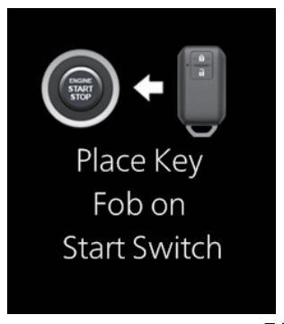 | — | — | See above. |
| 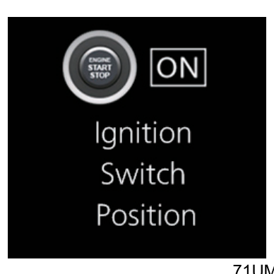 | Off | Off | ON ignition mode is selected. *(#1)* |
| 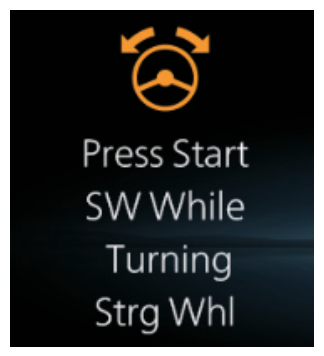 | Blinks | 1 beep | Steering lock is not disengaged. Lightly turn the steering wheel both ways and press the power switch again. |
| 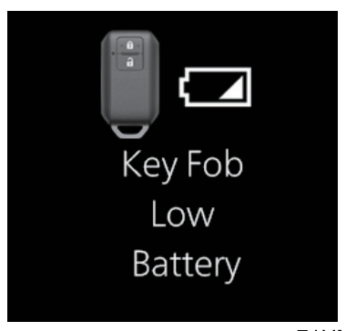 | Off | Off | Remote controller battery is almost flat. Replace it. *(#1)* |
| 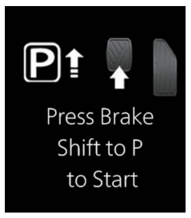 | Off | Off | Power switch pressed with gearshift not in P or N, or without brake depressed. Try again as instructed. |
| 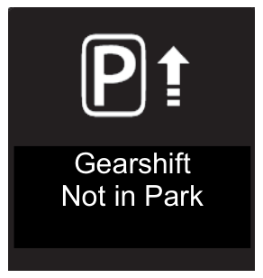 | Off | Off | Power switch pressed with gearshift not in P. Try again as instructed. |
| 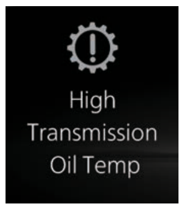 | Blinks | 1 beep | Transmission fluid temperature is too high. Stop safely and let the fluid cool down. |
| 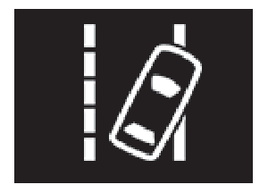 | Off | Short beep | Vehicle swaying warning is activated. See the vehicle swaying warning section for details. *(#1)* |
| 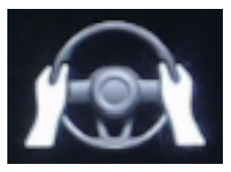 | Off | 1 beep | Dual Sensor Brake Support II (DSBS II) has been turned off. |
| 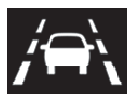 | Blinks | Beeps at short intervals | Lane keep assist system detects no steering input. Hold the steering wheel firmly. |
| 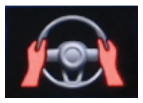 | Blinks | Beeps at short intervals or continuous | Lane keep assist system urgently detects no steering input. Hold the steering wheel firmly. |
|  | Blinks | Beeps at short intervals | Frontal collision warning, brake assist, or automatic brake system is activated. See DSBS II section for details. |
| 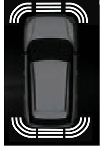 | — | Short beeps (rate increases with proximity) | Ultrasonic sensors detect an object. See [[05-18-06 Parking Sensors]] for details. |
| 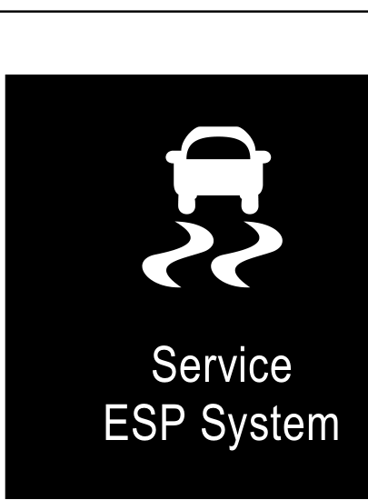 | Blinks | 1 beep | Possible problem with the ESP® system. Visit a Maruti Suzuki authorised workshop. |
| 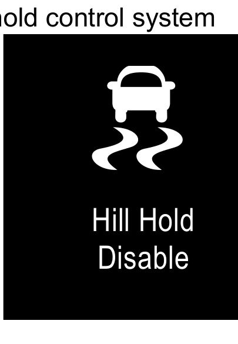 | Blinks | 1 beep | Possible problem with the hill hold control system. Visit a Maruti Suzuki authorised workshop. |

**Electric Parking Brake messages** (text-only on display, no graphic icon):

| Display Text | Master Warning Light | Sound | Cause and Remedy |
|---|---|---|---|
| Release Parking Brake | Blinks | Continuous short beeps | Electric parking brake not released. Stop safely and release it. |
| Vehicle Might Roll / Avoid Steep Slope | Blinks | Continuous beeps | Vehicle may move. Depress brake immediately and park on level ground. |
| Frequent Operation Temporarily Disabled | Blinks | Continuous short beeps | EPB switch operated repeatedly in quick succession. Wait before trying again. |
| Parking Brake Inspection Required | Blinks | 1 beep | EPB malfunction detected. Visit a Maruti Suzuki authorised workshop. |
| Parking Brake Unavailable | Blinks | Continuous beeps | EPB malfunction detected. Visit a Maruti Suzuki authorised workshop. |
| Parking Brake Auto Activated | Off | 1 beep | EPB activated automatically by another system. |
| Parking Brake Shift Synchro Fcn Activated | Off | 1 beep | EPB auto mode is ON. |
| Parking Brake Shift Synchro Fcn Deactivated | Off | 1 beep | EPB auto mode is OFF. |
| Push Switch While Pressing Brake Pedal | Off | Continuous short beeps | EPB switch operated without brake depressed. Depress brake and try again. |
| Parking Brake ON (Seatbelt/Door) | Off | Continuous short beeps | EPB cannot auto-release — seat belt not fastened or door not closed. Buckle up and close the door, then try again. |

**Brake Hold messages** (text-only on display, no graphic icon):

| Display Text | Master Warning Light | Sound | Cause and Remedy |
|---|---|---|---|
| Brake Hold Inspection Required | Blinks | 1 beep | Brake hold malfunction detected. Visit a Maruti Suzuki authorised workshop. |
| Brake Hold Unavailable / Steep Slope / Keep Braking | Blinks | Continuous beeps | Brake hold could not be set — vehicle may be on a steep slope. Park on level ground and reapply. |
| Brake Hold Unavailable (Seatbelt/Door) | Off | Continuous short beeps | Brake hold could not be set — seat belt not fastened or door not closed. Buckle up and close door, then try again. |
| Push Switch While Pressing Brake Pedal | Off | Continuous short beeps | Brake hold switch operated without brake depressed. Depress brake and try again. |

> *(#1) This message disappears after a certain period even if the condition is not resolved.*
