# Warning and Indicator Lights
When warning and indicator lights blink or come on, the corresponding messages may also be shown on the information display (Display C).

## Low Tyre Pressure Warning Light
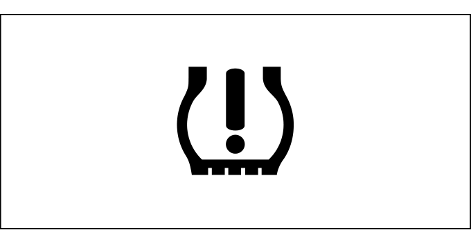
Your vehicle is equipped with a Tyre Pressure Monitoring System (TPMS). When the ignition mode is ON, this light comes on briefly so you can check that it works.

When this light is lit and stays on, one or more tyres is significantly under-inflated. Stop safely, check and inflate all tyres to the recommended pressure.

This light also blinks to indicate a TPMS malfunction. When the system detects a malfunction, the light blinks for about one minute and then stays on. Visit a Maruti Suzuki authorised workshop.

> **WARNING:** Failure to take corrective action when this light comes on or blinks can result in tyre failure, loss of control, and an accident.
> **NOTE:** This light may not come on immediately if you have a sudden loss of air pressure.

## Brake System Warning Light
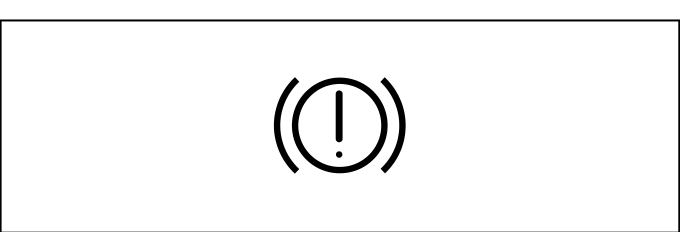
This light comes on briefly when the ignition mode is changed to ON. It also comes on when the brake fluid level falls below the specified level, or when the parking brake is applied. It should go out after the engine is started and the parking brake is fully released (provided the brake fluid level is sufficient).

If this light comes on while driving, the brake system may be malfunctioning:
1. Pull off the road and stop carefully.
2. Test the brakes by carefully starting and stopping on the shoulder of the road.
3. If the brakes seem normal, drive slowly to a Maruti Suzuki authorised workshop.

> **WARNING:** If this light stays on, stopping distance may be longer and the pedal may go down further — apply more pressure if needed. Have the system inspected immediately.
> **NOTE:** Because the brake system is self-adjusting, the fluid level will drop as the brake pads become worn. Replenishing the fluid when pads are worn does not fix the underlying issue — have the vehicle inspected.

## Seat Belt Reminder Light
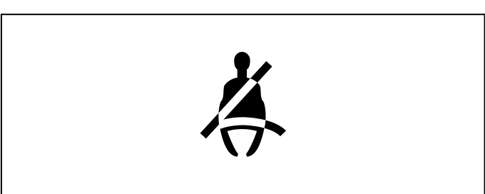
When the driver and/or front passenger does not buckle their seat belt, this light will come on and/or blink. A reminder message will also appear on the information display.

## Rear Passenger's Seat Belt Reminder Light
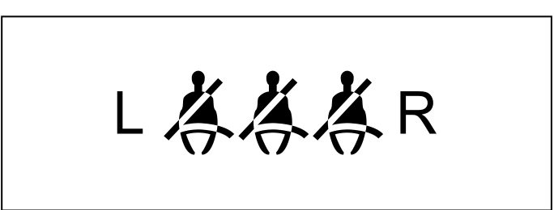
Reminder light for rear passengers to fasten their seat belts. For details, see [[02-09 Seat Belt]].

## Airbag Warning Light
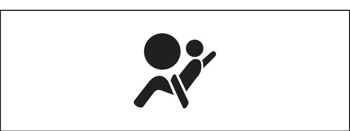
This light blinks or comes on for several seconds when the ignition mode is changed to ON. It will come on and stay on if there is a problem with the airbag system or the seat belt pretensioner system.

> **WARNING:** If this light does not blink or come on briefly at ignition, or if it stays on while driving, have the vehicle inspected by a Maruti Suzuki authorised workshop immediately. A malfunctioning airbag system may fail to deploy in a collision or may deploy unexpectedly.

## Low Fuel Warning Light
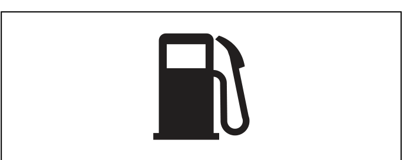
This light comes on when the remaining fuel level is approximately 5.0 L or less. A single ding sounds when it first comes on. If you do not refuel, it continues to sound at regular intervals.

> **NOTE:** The activation point may vary slightly on slopes or curves.

## Anti-lock Brake System (ABS) Warning Light
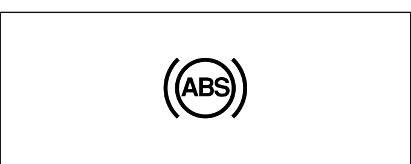
This light comes on briefly when the ignition mode is changed to ON. If it stays on, the ABS system may not be working. Your brakes will still work normally but without anti-lock support.

If the light stays on:
1. Pull off the road and stop carefully.
2. Turn the ignition mode to LOCK (OFF), then restart.
3. If the light stays on after restarting, have the vehicle inspected.

If both the ABS warning light and the brake system warning light stay on simultaneously, have the vehicle inspected immediately — the rear brake force control function may also be lost.

## Engine Coolant Temperature Warning Light

This light comes on briefly at ignition-ON to check it works. It has two functions:

**Blue (low temperature):** Stays on while the engine is cold and goes off once the engine reaches normal operating temperature. This is normal — avoid high engine loads until it goes off.

**Red (high temperature):** If this light blinks while driving, the engine is running hot.
> **WARNING:** Stop the vehicle immediately in a safe place. Do not continue driving — severe engine damage can result.

## Malfunction Indicator Light
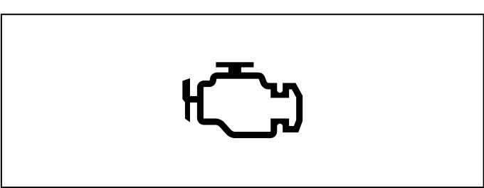
Your vehicle has a computer-controlled emission control system. This light indicates a fault detected by the on-board diagnostic system.

If the light comes on steadily: There is a problem with the emission control system. Have the vehicle inspected soon.

If the light blinks: There is a misfire that could damage the catalytic converter.
> **WARNING:** Stop immediately in a safe place if this light blinks.
> **NOTICE:** Continuing to drive with this light on or blinking can cause permanent damage to the emission control system and catalytic converter.

## Electric Power Steering Light
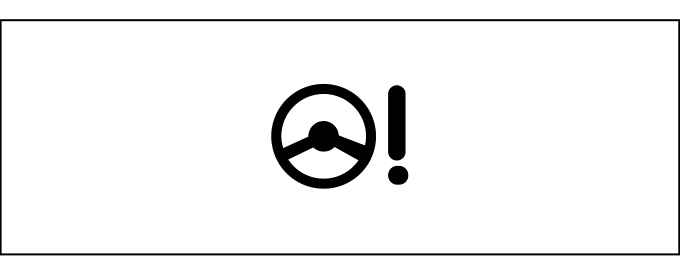
This light comes on briefly at ignition-ON. If it comes on while driving, the power steering system may not be functioning properly — steering effort will increase. Have the vehicle inspected by a Maruti Suzuki authorised workshop.

> **NOTE:** Using the steering wheel continuously at low speed or while parking can cause the power steering system to temporarily reduce assistance to protect itself. Once the system cools down, normal function resumes. Repeated occurrences should be inspected.

## Engine Oil Pressure Warning Light
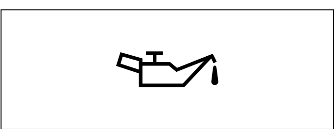
This light comes on briefly at ignition-ON. If it comes on while driving, the engine oil pressure may be too low.

Stop the engine immediately and check the oil level. Do not restart until the cause is identified and resolved.
> **NOTICE:** Operating the engine with this light on can cause severe engine damage. Do not rely solely on this light to monitor oil condition — check the oil level regularly.

## Charge Warning Light
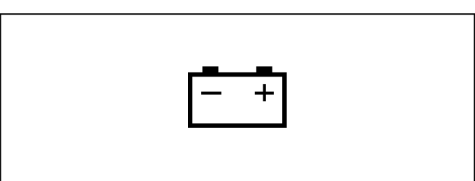
This light comes on briefly at ignition-ON. If it comes on while driving, the battery is not being charged properly. This may indicate a problem with the alternator or charging system. Have the vehicle inspected promptly to avoid a discharged battery.

## Cruise Control Indicator Light
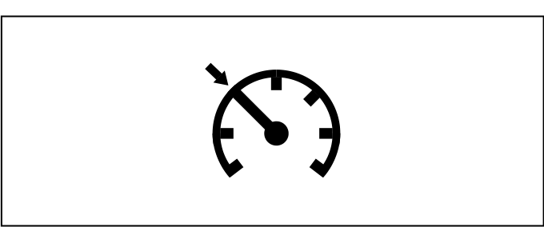
When the cruise control system is on, this light will be on.

## SET Indicator Light
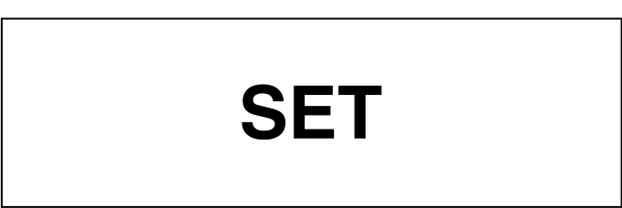
When a cruising speed has been set by the cruise control, this light will be on.

## Transmission Warning Light
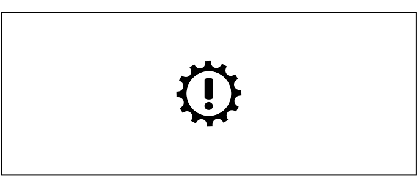
This light comes on briefly at ignition-ON. If it comes on when the ignition mode is changed to ON and then stays on, there is a problem with the automatic transmission. Have the vehicle inspected by a Maruti Suzuki authorised workshop.

## Immobilizer / Keyless Push Start System Warning Light
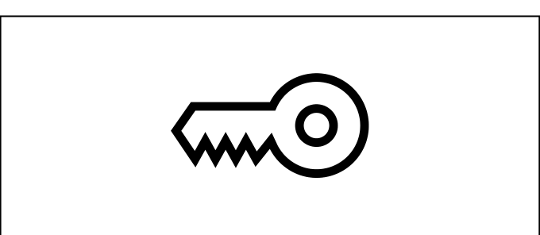
This light comes on briefly at ignition-ON. If it blinks or stays on after starting, there is a problem with the immobilizer or keyless push start system. If the issue persists at normal battery voltage, visit a Maruti Suzuki authorised workshop.

## Open Door Warning Light
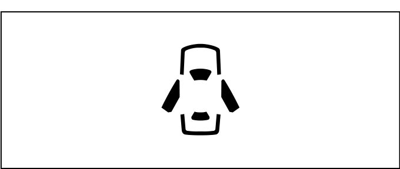
This light stays on until all doors (including the tailgate) are completely closed. If a door is open while the vehicle is moving, a ding sounds to remind you to close it.

## Turn Signal Indicators
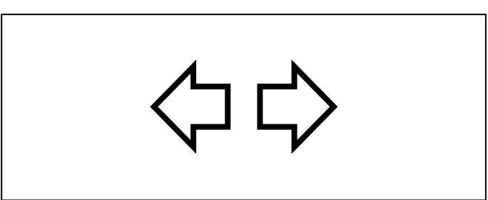
When the left or right turn signals are turned on, the corresponding green arrow on the instrument panel will blink. If there is abnormal blinking (such as faster-than-normal blinking), there may be a malfunction in the turn signal circuit.

## Main Beam (High Beam) Indicator Light
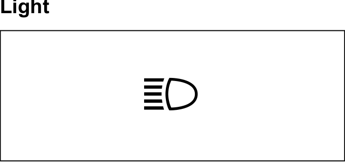
This indicator comes on when the headlight high beams (main beams) are turned on.

## Illumination Indicator Light
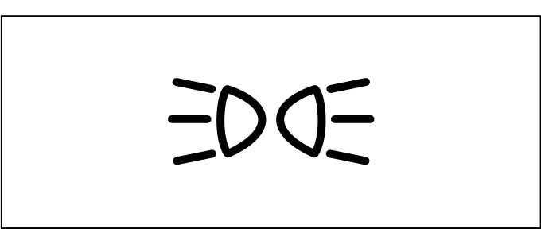
This indicator light comes on while the position lights, tail lights, and/or headlights are on.

## ESP® OFF Indicator Light
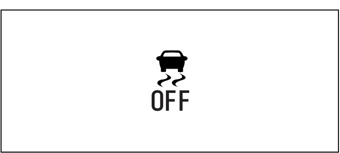
This light comes on briefly at ignition-ON. When the ESP® OFF switch is pushed to disable the ESP® systems (other than ABS), this light stays on. For details, see the Electronic Stability Program section.

## ESP® Warning Light
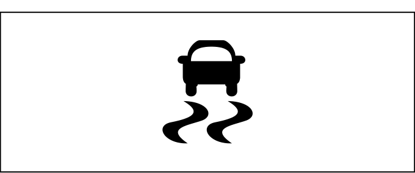
This light blinks at approximately 5 times per second when one of the ESP® systems (other than ABS) is activated while driving — this is normal operation. It comes on briefly at ignition-ON as a bulb check. If it stays on while driving, there may be a problem with the ESP® system.

For details, see the Electronic Stability Program section.
> **WARNING:** The ESP® systems cannot prevent accidents. Always drive carefully.

## ENG A-STOP Indicator Light
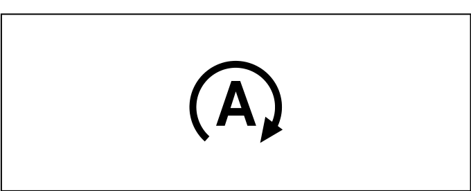
This light comes on briefly at ignition-ON as a system check. When the engine stops automatically due to the ENG A-STOP (Engine Auto Stop Start) system, this light comes on.

For details, see [[05-09 ENG A-STOP System]].

## Front Fog Light Indicator Light
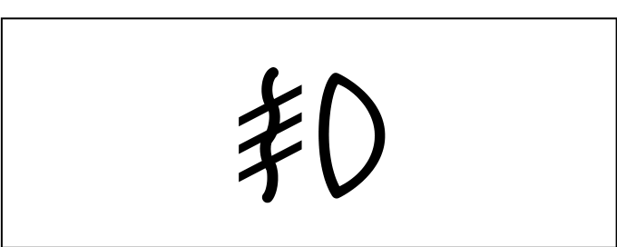
This light comes on when the front fog light is operating.

## ENG A-STOP OFF Indicator Light
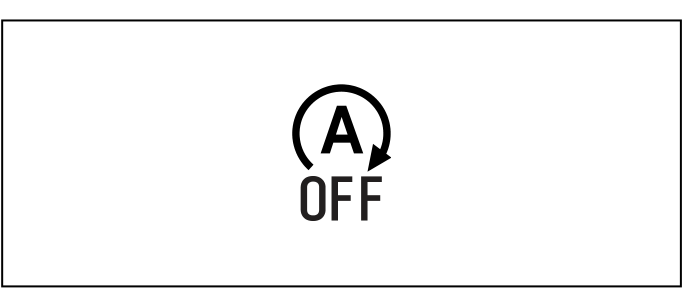
This light comes on briefly at ignition-ON if the system is operating normally. When you push the ENG A-STOP OFF switch, this light stays on. If this light blinks while driving, there may be a problem with the ENG A-STOP system — have the vehicle inspected.

## Master Warning Indicator Light
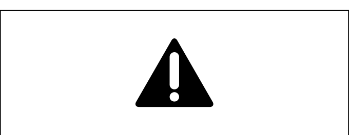
This light comes on briefly at ignition-ON. When the information display shows warning or indicator messages (Display C), this indicator light may also blink. For details, see [[04-02 Information Display (Type B)]].

## Hybrid System Warning Light
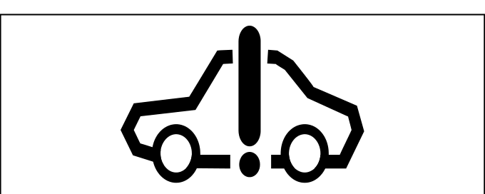
This light comes on briefly at ignition-ON as a system check. If it comes on or blinks while driving, there is a problem with the SHVS hybrid system. Have the vehicle inspected by a Maruti Suzuki authorised workshop.

## Deceleration Energy Regenerating Indicator Light
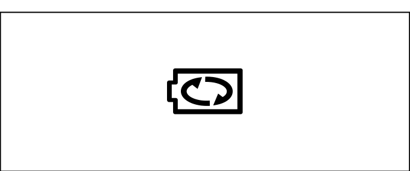
This light comes on briefly at ignition-ON. When the deceleration energy regenerating function (SHVS) is actively charging the hybrid battery, this light comes on.

For details, see [[05-12 SHVS]].

## High Beam Assist Warning Light (Yellow)

This light comes on briefly in yellow at ignition-ON as a system check. If it comes on and stays on, the high beam assist system has a failure — the Dual Sensor Brake Support II (DSBS II) will also stop functioning.

> **NOTE:** If the dual sensor function is temporarily suspended, high beam assist also stops temporarily.

## Dual Sensor Brake Support II (DSBS II) Indicator Light
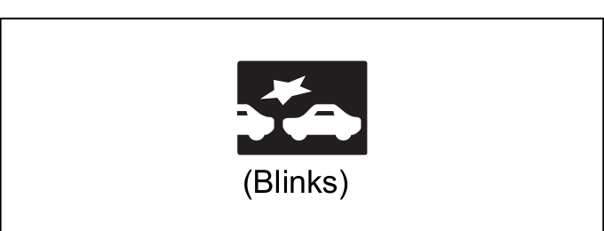
This light blinks when the brake support function of DSBS II is actively operating (i.e., the system is applying braking). For details, see [[05-17 DSBS II]].

## Dual Sensor Brake Support II (DSBS II) OFF Indicator Light
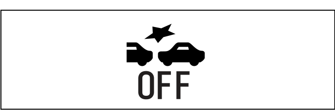
This light comes on briefly at ignition-ON. In certain conditions (such as a blocked sensor or system fault), this light comes on and DSBS II will stop functioning. If it comes on and stays on due to a system problem, have the vehicle inspected.

For details, see [[05-17 DSBS II]].

## Lane Departure Prevention Indicator Light
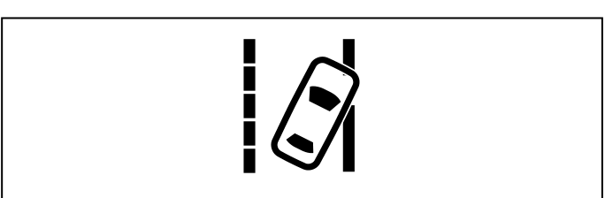
This light illuminates or blinks depending on the operating status of the lane departure prevention or lane departure warning system. When the system is functioning normally, it illuminates in yellow for a few seconds at engine start. For details, see [[05-14 Lane Departure Prevention]].

## Lane Departure Prevention OFF Indicator Light
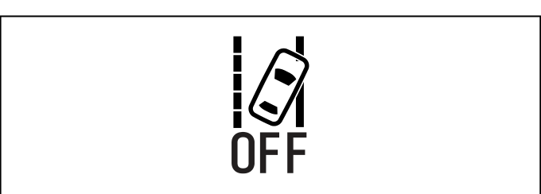
When the lane departure prevention OFF switch is pushed and held to disable the system, this light comes on.

For details, see [[05-14 Lane Departure Prevention]].

## Lane Keep Assist Indicator Light
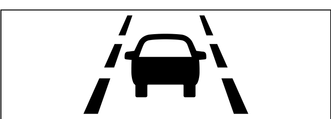
The display colour, illumination, and blinking state change depending on the operating status of the lane keep assist system. When the system is functioning normally, the light illuminates in yellow for a few seconds at engine start. For details, see [[05-15 Lane Keep Assist]].

## High Beam Assist Indicator Light (Green)
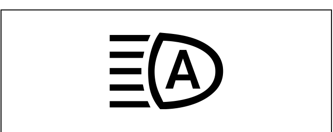
When the high beam assist system is actively controlling the headlights, this light comes on in green. For details, see the high beam assist section.

## Adaptive Cruise Control Indicator Light
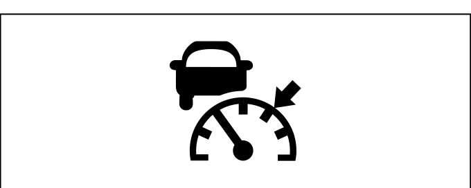
The indicator colour and on/off status change depending on the operating status of the adaptive cruise control system. For details, see [[05-16 Adaptive Cruise Control]].

## Blind Spot Monitor (BSM) OFF Indicator Light
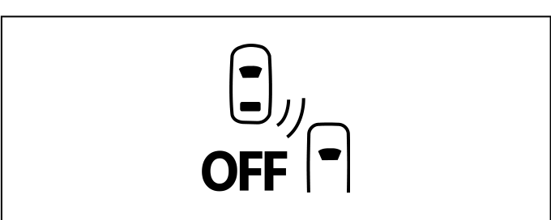
This light comes on briefly at ignition-ON. When the blind spot monitor (BSM) is turned off via the information display settings, this light stays on. For details, see [[05-18-04 BSM]].

## Rear Cross Traffic Alert (RCTA) OFF Indicator Light
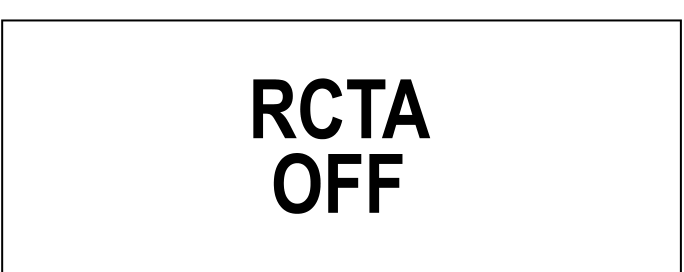
This light comes on briefly at ignition-ON. When the rear cross traffic alert (RCTA) is turned off via the information display settings, this light comes on. For details, see [[05-18-05 RCTA]].

## Parking Sensor Indicator Light
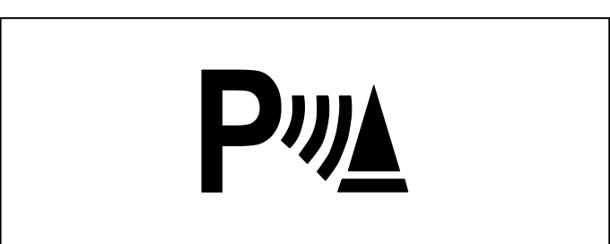
This light comes on briefly at ignition-ON. When the rear parking sensors detect an obstacle, this light blinks. If this light comes on and stays on (without an obstacle being detected), there is a problem with the parking sensors — have the vehicle inspected.

For details, see [[05-18-06 Parking Sensors]].

## Steering Assist Indicator Light
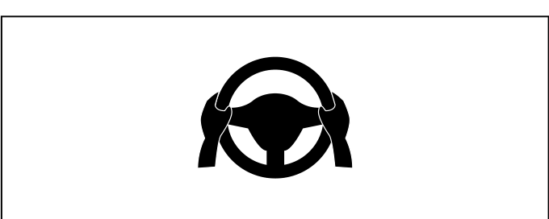
This light illuminates when the lane departure prevention or lane keeping assist system is actively applying steering inputs. The display colour changes depending on the system status. When functioning normally, it illuminates in white for a few seconds at engine start.

## Electric Parking Brake Operation Indicator Light
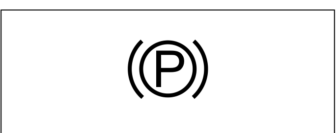
This indicator comes on when the electric parking brake (EPB) is engaged. It blinks when the EPB is in the process of engaging or releasing. If it blinks abnormally or stays on unexpectedly, there may be a problem with the EPB system — see the warning messages in [[04-02 Information Display (Type B)]] for details.
