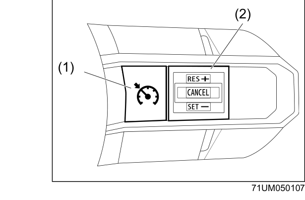
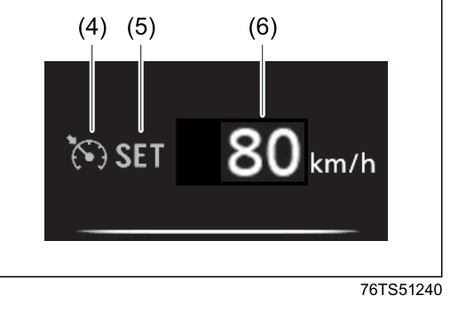
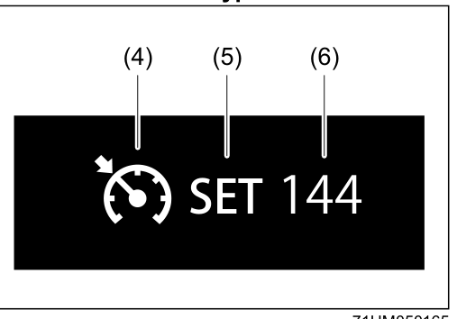

# Cruise Control (if equipped)
The cruise control system allows you to maintain a steady speed without keeping your foot on the accelerator pedal. The controls are located on the steering wheel.

> **WARNING:** Do not use the cruise control system when driving in heavy traffic, on slippery or winding roads, or on steep downhills, as this may cause loss of vehicle control.

## Controls

**(1) Cruise switch** — turns the cruise control system on and off
**(2) RES+ / CANCEL / SET– switch** — sets speed, resumes previously set speed, and cancels cruise control

## Usage Conditions
For the 6-speed automatic transmission, cruise control can be used when:
- The gearshift lever is in "D" position, or the gear position is 3rd, 4th, 5th, or 6th in Manual mode
- Vehicle speed is approximately 40 km/h or higher

## Setting Cruising Speed

**(4) Cruise indicator** — comes on when the cruise control system is switched on
**(5) "SET" indicator** — comes on when a cruising speed has been set
**(6) Set speed indication** — displays the set speed

1. Press the Cruise switch (1) to turn on the system. The cruise indicator (4) comes on.
2. Accelerate or decelerate to the desired speed.
3. Push down the RES+/SET– switch (2). The SET indicator (5) and set speed indication (6) come on. Take your foot off the accelerator pedal — the set speed will be maintained.

> **NOTE:** The established cruising speed may differ slightly from the speedometer reading depending on road conditions.

> **WARNING:** If the cruising speed is set accidentally, you may be unable to decelerate or could lose control of the vehicle. Turn off the cruise control system and confirm the cruise indicator (4) is off when the system is not in use.

## Changing Speed Temporarily
**To accelerate temporarily:** Depress the accelerator pedal. When you lift your foot off, the vehicle returns to the set speed.

**To decelerate temporarily:** Depress the brake pedal. The set speed is cancelled and the SET indicator (5) goes off. To resume the previously set speed, push up the RES+/SET– switch (2) when vehicle speed is above 40 km/h.

> **NOTE:** When cruising speed is maintained, you cannot decelerate using engine braking even if you downshift to 3rd in Manual mode. To decelerate with cruise on, depress the brake pedal or push down the RES+/SET– switch (2).

## Changing Cruising Speed
**Using the accelerator pedal:** Accelerate to the new desired speed, then push down the RES+/SET– switch (2). The new speed is maintained.

**Using the brake pedal:** Decelerate to the new desired speed, then push down the RES+/SET– switch (2). The new speed is maintained.

**Using the RES+/SET– switch directly:**
- To increase speed: press or hold the switch up (RES+). Speed increases steadily; release the switch when the new speed is reached.
- To decrease speed: press or hold the switch down (SET–). Speed decreases steadily; release the switch when the new speed is reached.
- Each quick press adjusts the set speed by approximately 1 km/h.

> **NOTE:** If the current vehicle speed is more than approximately 10 km/h faster than the set speed, pushing SET– will not decrease the cruising speed. Similarly, if the current speed is more than approximately 10 km/h slower than the set speed, pushing RES+ will not increase it.

## Cancelling Cruise Control
The SET indicator (5) goes off and cruise control is temporarily cancelled in any of the following situations:
- The CANCEL switch (2) is pressed
- The brake pedal is depressed
- Downshifting from 3rd to 2nd in Manual mode
- Vehicle speed falls more than approximately 20% below the set speed
- Vehicle speed falls below 40 km/h
- The vehicle skids and ESP® is activated

To resume the previously set speed after temporary cancellation, push up the RES+/SET– switch (2) when vehicle speed is above 40 km/h.

To turn off the cruise control system completely, press the Cruise switch (1) and confirm the cruise indicator (4) is off. Turning off the system clears the set speed from memory — you will need to reset your cruising speed next time.

The cruise control system also turns off automatically if the malfunction indicator light in the instrument cluster comes on or blinks.
