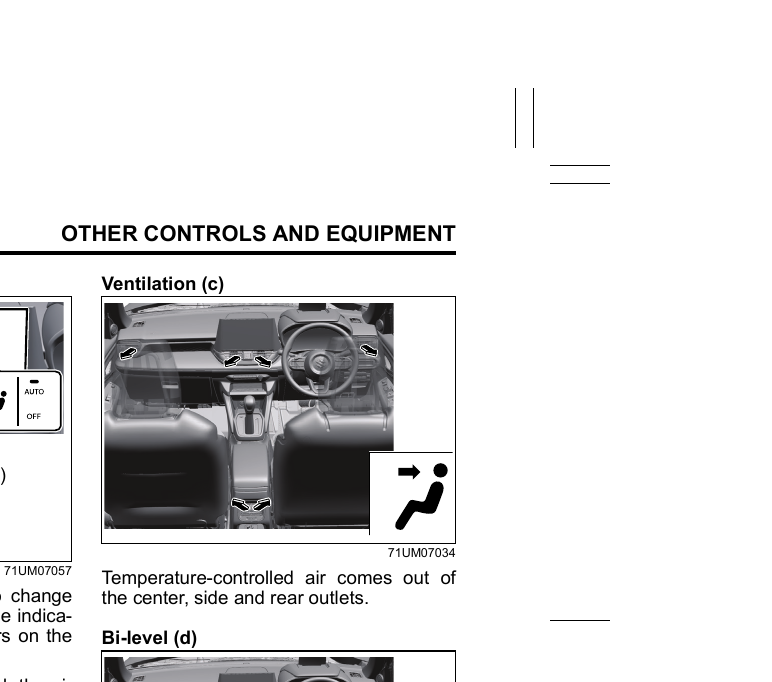
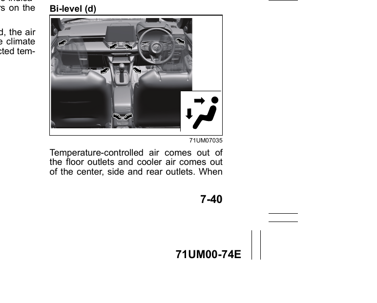
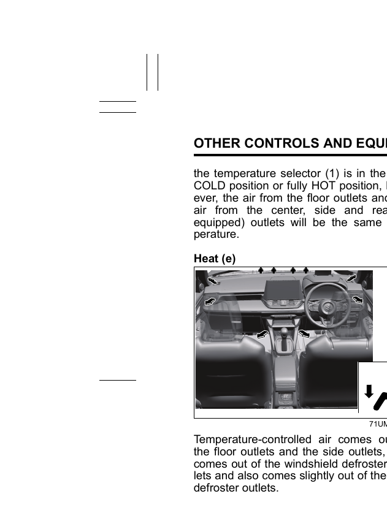
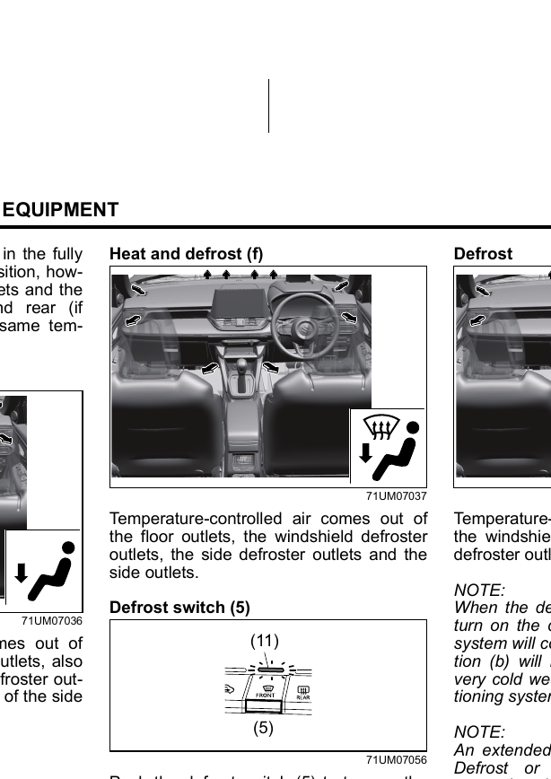
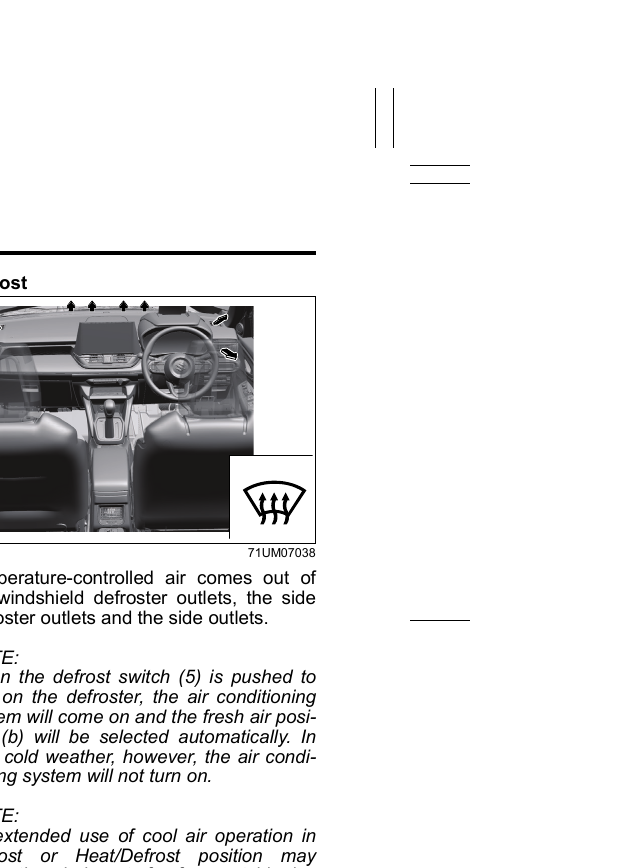

# Automatic Heating and Air Conditioning System (Climate Control)
The climate control system maintains a set cabin temperature automatically by controlling the blower speed, air intake, and air flow. The controls are labelled as follows: (1) Temperature selector, (2) Blower speed selector, (3) Air intake selector, (4) Air flow selector, (5) Defrost switch, (6) Air conditioning switch, (7) OFF switch, (8) AUTO switch, (9) Display.
## Temperature Selector (1)
Push the upper part to increase and the lower part to decrease the set temperature. The selected temperature appears on the display. When "HI" or "LO" appears, the system is operating at maximum heating or cooling — the outlet air temperature may change suddenly at these settings, but this is normal.

> **NOTE:** The temperature unit (°C/°F) can be changed from the information display. Refer to [[04-00 Instrument Cluster]] for details.
## Blower Speed Selector (2)
Press to turn on the blower and select the speed. In AUTO mode, blower speed is controlled automatically.
## Air Intake Selector (3)
Press to toggle between the two modes:

**Recirculated Air:** Inside air is recirculated. The indicator light turns on. Use this when driving through polluted air (e.g. tunnels), to cool the cabin quickly, or to reduce unwanted odours from entering.

**Fresh Air:** Outside air is introduced. The indicator light turns off.

> **NOTE:** Do not use recirculated air for extended periods — the cabin air may become stale and windows may mist. Switch to fresh air whenever possible.
## Air Flow Selector (4)
Press to cycle through the following modes. The selected mode appears on the display. In AUTO mode, the air flow is controlled automatically — but will not automatically switch to the defrost position.

**Ventilation (c):** Temperature-controlled air from the center, side, and rear outlets.

**Bi-level (d):** Temperature-controlled air from the floor outlets, and cooler air from the center, side, and rear outlets. When the temperature selector is at fully COLD or fully HOT, both sets of outlets deliver air at the same temperature.

**Heat (e):** Temperature-controlled air from the floor outlets and side outlets; air also comes from the windshield defroster outlets, and slightly from the side defroster outlets.

**Heat and Defrost (f):** Temperature-controlled air from the floor outlets, windshield defroster outlets, side defroster outlets, and side outlets. Use this to simultaneously warm the cabin and clear the windshield.

## Defrost Switch (5)
Push to activate the defroster. The indicator light turns on. Air comes from the windshield defroster outlets, side defroster outlets, and side outlets. When activated, the AC system turns on and fresh air mode is selected automatically (in very cold weather, the AC system will not turn on).

> **NOTE:** Extended use of cool air in Defrost or Heat and Defrost mode may cause the outside of the windows to fog due to the temperature difference between the cabin and outside air. Avoid using the cooling function in these positions.
## Air Conditioning Switch (6)
Push to turn the air conditioning system on or off (only works when the blower is running). The indicator light shows its status. When the AC is off, the climate control system cannot lower the cabin temperature below the outside temperature.
## OFF Switch (7)
Turns the climate control system off entirely.
## Automatic Operation
1. Start the engine.
2. Push the AUTO switch (8).
3. Set the desired temperature using the temperature selector (1).

The system will automatically control blower speed, air intake, and air flow to maintain the set temperature.

> **NOTE:** Selecting recirculated air mode deactivates the automatic operation of the AUTO switch. You can still manually turn the AC on or off using switch (6) regardless of AUTO mode.
## When the Engine Stops Automatically (ENG A-STOP)
When the engine stops automatically, the air conditioner switches to the ventilation position.
- If cooling or heating performance becomes insufficient, press the ENG A-STOP OFF switch to restart the engine.
- If the windshield or door windows fog while the engine is stopped, deactivate ENG A-STOP to restart the engine, then set the air flow selector to Heat and Defrost or Defrost to clear the windows.

> **NOTE:** Do not place anything on the instrument panel that may cover the defrost air outlets — this will obstruct airflow and prevent the windshield from defogging. Remove snow and ice from the outside of windows before driving.
## Preventing and Clearing Window Fog
When outside temperature and humidity are high (e.g. in summer), fog may form on the outside of the windshield:
- Switch on the windshield wipers.
- Increase the cabin temperature using the temperature selector (1).
- Reduce blower speed using the blower speed selector (2).
## Maintenance
To maintain optimum performance and durability, run the air conditioner for at least one minute per month with the engine idling, even during winter. This circulates the refrigerant and oil and protects the internal components.

> **NOTICE:** Use R-134a refrigerant only. Do not mix or replace it with other refrigerants, as this may damage the air conditioning system.
