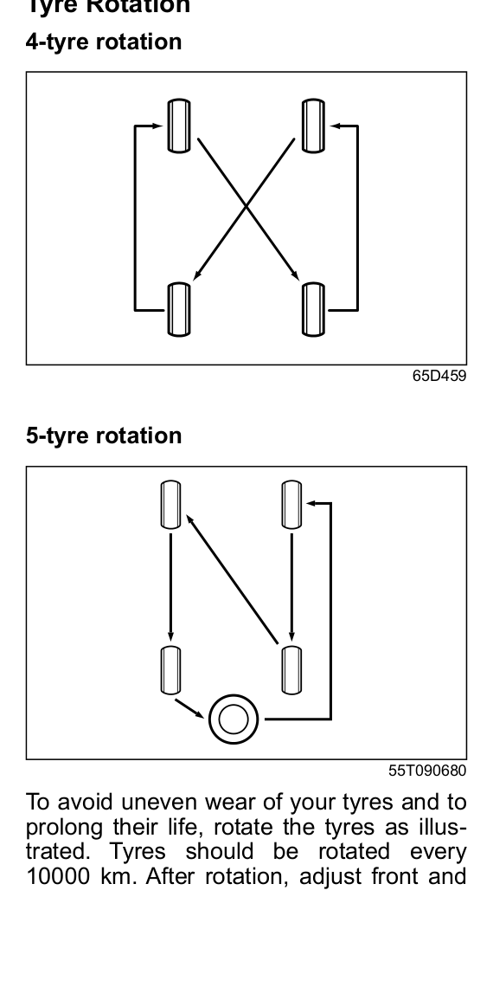

# Tyres
## Maintenance Schedule — K15C Engine
| Item | 1k | 5k | 10k | 20k | 30k | 40k | 50k | 60k | 70k | 80k |
|------|:---:|:---:|:---:|:---:|:---:|:---:|:---:|:---:|:---:|:---:|
| Tyres (air pressure, abnormal wear, cracks & rotation) | I | I&O | I&O | I&O | I&O | I&O | I&O | I&O | I&O | I&O |
| Wheels (damage) | I | I | I | I | I | I | I | I | I | I |
| Front/rear wheel bearing (loose, damage) | I | I | I | I | I | I | I | I | I | I |

## Tyre Pressure
**Recommended pressure: 33 PSI (228 kPa)**

Check the tyre pressure specifications on the Tyre Information Label inside your vehicle. Both front and rear tyres should have the specified pressure.

> [!warning] Always check tyre pressure when the tyres are cold — readings taken after driving will be inaccurate. Never under-inflate or over-inflate.
> - Under-inflation can cause unusual handling, cause the rim to slip on the tyre bead, and result in an accident or damage to the tyre or rim.
> - Over-inflation can cause the tyre to burst and result in personal injury, and also causes unusual handling.

Note that tyre pressure changes with temperature and atmospheric conditions. If you check tyres after driving (when warm), add 1 kPa for every 0.8°C difference between garage temperature and outside temperature. If inflated in a warm garage and then driven in cold weather, pressure may fall below specification.

## Tyre Inspection
Inspect tyres at least once a month or before any long trip. Check the following:

1. Measure air pressure with a tyre gauge and adjust if necessary.
2. Check that tread groove depth is more than **1.6 mm**. Tyres have moulded-in tread wear indicators (marked by a triangular TWI symbol on the sidewall). When these indicators appear flush with the tread surface, the remaining depth is 1.6 mm or less — replace the tyre immediately.
3. Check for abnormal wear, cracks and damage. Replace any tyre with cracks or other damage. Have abnormally worn tyres inspected at a Maruti Suzuki authorised workshop.
4. Check for loose wheel nuts.
5. Check that there are no nails, stones, or other objects stuck in the tyres.

> [!caution] Hitting curbs and running over rocks can damage tyres and affect wheel alignment. Have tyres and wheel alignment checked periodically at a Maruti Suzuki authorised workshop.

> [!warning] Never mix tyres of different size or type on the four wheels. Use only wheel and tyre combinations approved by Maruti Suzuki as standard or optional equipment. Replacing tyres with a different size may result in false speedometer or odometer readings.

## Tyre Rotation
Rotate tyres every **10,000 km** to avoid uneven wear and prolong their life. After rotation, adjust front and rear tyre pressures to the specification on the Tyre Information Label.

The circle in the 5-tyre rotation diagram represents the spare tyre.

## Wheel Balancing
If the vehicle vibrates abnormally on a smooth road, have the wheel balanced at a Maruti Suzuki authorised workshop.

## Wheel Alignment
In case of abnormal tyre wear or pulling towards one side, have the wheel aligned at a Maruti Suzuki authorised workshop.

## Tubeless Tyres
The Victoris is equipped with tubeless tyres. A thin layer of butyl rubber lines the inside of the tyre to prevent air loss. Air pressure is maintained by the seal between the tyre bead and wheel rim. Tubeless tyres have the advantage of slow air loss and prevention of sudden deflation while driving.

Care and maintenance tips:

1. Always maintain recommended inflation pressure. Driving continuously at low pressure can lead to tyre damage.
2. If any leakage is found, check for nail penetration, valve core damage, or a bent rim. A damaged wheel must not be used.
3. If the tyre has run at low pressure, have it inspected for any defect.
4. Whenever a new tyre is fitted, replace the valve.
5. For continuous high-speed driving, increase tyre pressure by 5 PSI over the recommended inflation pressure.
6. Never run the tyre beyond TWI (Tread Wear Indicator). Replace when the remaining tread has worn to this point.
7. Always use a tubeless tyre mounting machine — manual mounting can damage the tyre or wheel rim.
8. In case of any problem, contact a Maruti Suzuki authorised workshop.
