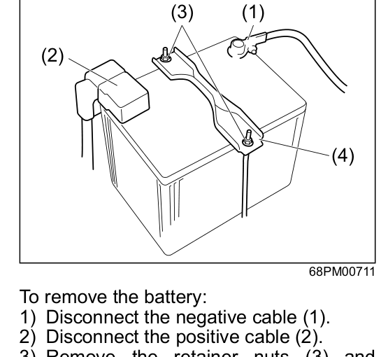

# Battery
## Maintenance Schedule — K15C Engine
| Item | 1k | 5k | 10k | 20k | 30k | 40k | 50k | 60k | 70k | 80k |
|------|:---:|:---:|:---:|:---:|:---:|:---:|:---:|:---:|:---:|:---:|
| Battery — electrolyte (level, leakage) & voltage | I | I | I | I | I | I | I | I | I | I |

> [!warning] When checking or servicing the battery, disconnect the negative cable first. Do not cause a short circuit by allowing metal objects to contact the battery posts and the vehicle at the same time. Batteries produce flammable hydrogen gas — keep flames and sparks away. Never smoke when working near the battery. Diluted sulphuric acid spilled from the battery can cause blindness or severe burns. Use proper eye protection and gloves. Flush eyes or body with ample water and get medical care immediately if affected. Keep batteries out of reach of children.

## Battery Types
**Maintenance-free (cap-less) battery:** No need to add water.

**Traditional battery (with water filler caps):** The battery solution level must be kept between the **MAX (1)** and **MIN (2)** lines at all times. Periodically check the battery, battery terminals, and battery hold-down bracket for corrosion. Remove corrosion using a stiff brush with ammonia mixed with water, or baking soda mixed with water. Rinse with clean water after.

If the battery liquid level falls below the centre of the MAX–MIN range, add distilled water until it reaches the MAX (1) line.

> [!warning] Do not use the battery if the level is below the MIN line (2) — this may cause reduced battery life, exothermic heat, or an explosion from hydrogen gas. Do not add battery liquid above the MAX line (1) — overfilling may cause liquid to leak or spray during charging.

## Keeping the Battery Charged
The lead-acid battery and lithium-ion battery (if equipped) discharge gradually. To avoid a flat battery, drive the vehicle at least once a month for at least 30 minutes to recharge it.

If the vehicle will not be driven for a month or longer, disconnect the cable from the negative terminal to help prevent discharge.

## Battery Replacement

**(1)** Negative cable — **(2)** Positive cable — **(3)** Retainer nuts — **(4)** Retainer

**To remove the battery:**
1. Disconnect the negative cable (1).
2. Disconnect the positive cable (2).
3. Remove the retainer nuts (3) and remove the retainer (4).

**To install the battery:**
1. Install the battery in the reverse order of removal.
2. Tighten the bracket bolt and battery cables securely.

> [!notice]
> - When the battery is disconnected, some vehicle functions will be initialised and/or deactivated. These functions will need to be reset after the battery is reconnected.
> - Do not disconnect the battery terminals for at least one minute after the engine is switched off or the ignition mode is changed to LOCK (OFF).
> - If your vehicle is equipped with the ENG A-STOP system, only use the specified battery type for that system. Refer to [[12-00 Specifications]] for details. Otherwise, the ENG A-STOP system may not function — consult a Maruti Suzuki authorised workshop.

> [!warning] Batteries contain toxic substances including sulphuric acid and lead. Used batteries must be disposed of or recycled according to applicable rules and regulations — do not dispose of with ordinary household trash. Do not tip the battery over when removing it from the vehicle, as sulphuric acid could spill and cause injury.
