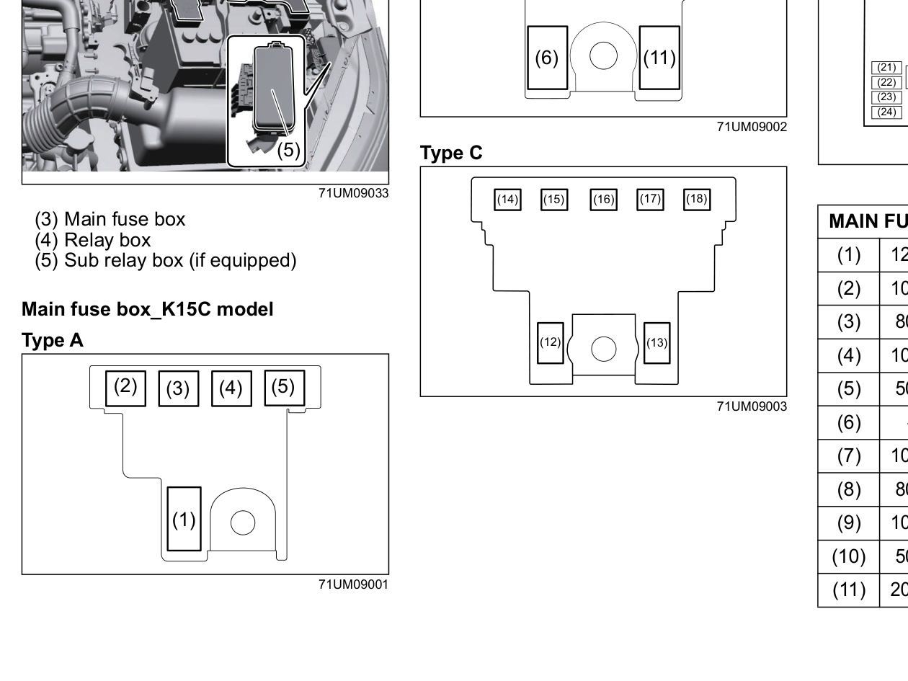
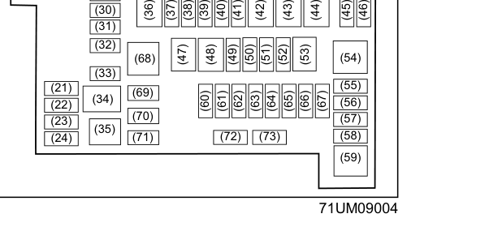
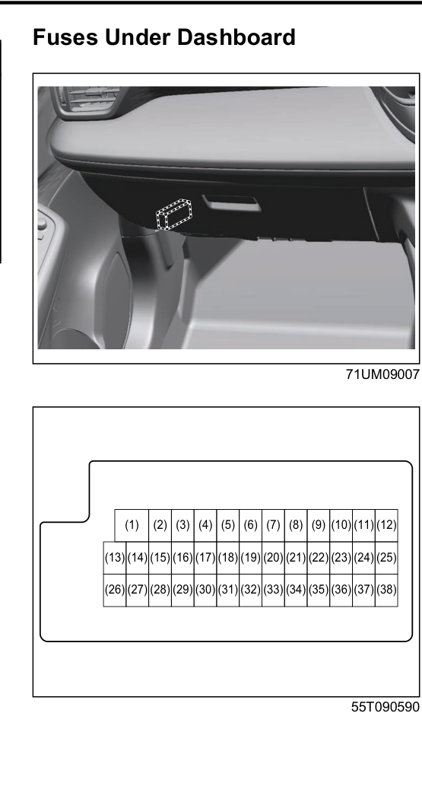
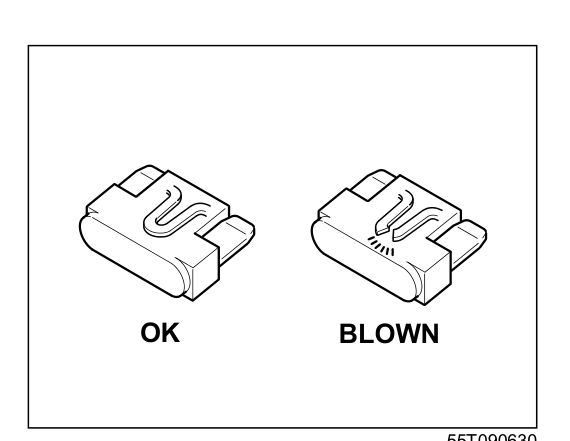

# Fuses
## Maintenance Schedule — K15C Engine
| Item | 1k | 5k | 10k | 20k | 30k | 40k | 50k | 60k | 70k | 80k |
|------|:---:|:---:|:---:|:---:|:---:|:---:|:---:|:---:|:---:|:---:|
| Fuses (condition) | I | I | I | I | I | I | I | I | I | I |

## Fuses in Engine Compartment
The engine compartment has three fuse/relay boxes: **(3)** Main fuse box, **(4)** Relay box, and **(5)** Sub relay box (if equipped).

The main fuse box uses one of the following layouts depending on the vehicle configuration:

**Relay box — K15C engine model**

### Main Fuse / Primary Fuse
| Slot | Amperage | Label |
|------|----------|-------|
| (1) | 120 A | FL1 |
| (2) | 100 A | FL2 |
| (3) | 80 A | FL3 |
| (4) | 100 A | FL4 |
| (5) | 50 A | FL5 |
| (6) | — | Blank |
| (7) | 100 A | FL1 |
| (8) | 80 A | FL2 |
| (9) | 100 A | FL3 |
| (10) | 50 A | FL4 |
| (11) | 200 A | FL5 |
| (12) | 175 A | FL1 |
| (13) | 120 A | FL2 |
| (14) | 100 A | FL3 |
| (15) | 80 A | FL4 |
| (16) | 100 A | FL5 |
| (17) | 60 A | FL6 |
| (18) | 100 A | FL7 |

### Fuse Table — Engine Compartment
| Slot | Amperage | Circuit |
|------|----------|---------|
| (19) | — | Blank |
| (20) | — | Blank |
| (21) | 5 A | Turn_R |
| (22) | 5 A | Turn_L |
| (23) | 5 A | Tail2 |
| (24) | 5 A | Stop2 |
| (25) | — | Blank |
| (26) | 25 A | Towing |
| (27) | 20 A | Power seat driver |
| (28) | 15 A | S/V |
| (29) | 15 A | CHG3 |
| (30) | 25 A | Radio2 |
| (31) | 20 A | Power seat driver 2 |
| (32) | — | Blank |
| (33) | — | Blank |
| (34) | — | Blank |
| (35) | — | Blank |
| (36) | — | Blank |
| (37) | 15 A | CHG2 |
| (38) | 10 A | CPRSR |
| (39) | 10 A | Front Fog |
| (40) | 20 A | S/R |
| (41) | 30 A | B/U |
| (42) | — | Blank |
| (43) | 30 A | Starting motor |
| (44) | 40 A | Blower fan |
| (45) | 5 A | SPARE |
| (46) | 7.5 A | SPARE |
| (47) | 40 A | ABS motor |
| (48) | 30 A | Radiator fan |
| (49) | 20 A | FI |
| (50) | 25 A | ABS control module |
| (51) | 15 A | Headlight (Right) |
| (52) | 10 A | Airbag 2 |
| (53) | — | Blank |
| (54) | 40 A | Ignition switch 11 |
| (55) | 20 A | Headlight HI |
| (56) | 15 A | 4WD (For 4WD vehicle) |
| (57) | 10 A | Power back door 2 |
| (58) | 15 A | Headlight (Left) |
| (59) | 30 A | Power back door 1 |
| (60) | 7.5 A | CNG |
| (61) | 5 A | CNG IG1 |
| (62) | 5 A | Starting signal |
| (63) | 10 A | Headlight HI (Left) |
| (64) | 10 A | Headlight HI (Right) |
| (65) | 20 A | FI 2 |
| (66) | 10 A | CPRSR 2 |
| (67) | 15 A | Transmission 2 |
| (68) | 50 A | Ignition switch 2 |
| (69) | 20 A | SPARE |
| (70) | 25 A | SPARE |
| (71) | 30 A | SPARE |
| (72) | 15 A | SPARE |
| (73) | 10 A | SPARE |

## Fuses Under Dashboard
> [!note] Check that the fuse box always carries spare fuses.

> [!warning] If the main fuse or a primary fuse blows, have your vehicle inspected by a Maruti Suzuki authorised workshop. Always use a genuine Maruti Suzuki replacement. Never use a substitute such as a wire even for a temporary repair — extensive electrical damage and a fire can result.

### Primary Fuse Table — Under Dashboard
| Slot | Amperage | Circuit |
|------|----------|---------|
| (1) | 30 A | Power window |
| (2) | 10 A | Meter |
| (3) | 15 A | Ignition coil |
| (4) | 5 A | Ignition-1 signal 2 |
| (5) | 20 A | Shift lever* |
| (6) | 10 A | CHG |
| (7) | 10 A | STL2 |
| (8) | 20 A | Door |
| (9) | 15 A | Steering lock |
| (10) | 10 A | Hazard |
| (11) | 5 A | A-STOP controller |
| (12) | 10 A | Rear fog lamp |
| (13) | 5 A | ABS / ESP® control module |
| (14) | 15 A | Seat heater |
| (15) | 5 A | Ignition-1 signal 3 |
| (16) | 10 A | Dome light-2 |
| (17) | 5 A | Dome light |
| (18) | 15 A | Radio |
| (19) | 5 A | CONT |
| (20) | 5 A | Key-2* |
| (21) | 20 A | Power window timer |
| (22) | 5 A | Key* |
| (23) | 15 A | Horn |
| (24) | 5 A | Tail light (Left) |
| (25) | 10 A | Tail light |
| (26) | 10 A | Air bag |
| (27) | 10 A | Ignition-1 signal |
| (28) | 10 A | Back up light |
| (29) | 5 A | ACC-3* |
| (30) | 20 A | Rear defogger |
| (31) | 10 A | Heated mirror* |
| (32) | 15 A | ACC-2 |
| (33) | 5 A | ACC |
| (34) | 10 A | Wiper |
| (35) | 5 A | Ignition-2 signal |
| (36) | 15 A | Washer |
| (37) | 25 A | Front wiper |
| (38) | 10 A | Stop light |

*\* Feature not available in the vehicle*

## Checking and Replacing a Fuse

A fuse with an intact wire is OK. A fuse with a broken wire is blown and must be replaced.

To remove a fuse, use the fuse puller provided in the fuse box. Always replace a blown fuse with one of the correct amperage.

> [!warning] Always replace a blown fuse with a fuse of the correct amperage. Never use a substitute such as aluminium foil or wire to replace a blown fuse. If you replace a fuse and the new one blows in a short period of time, you may have a major electrical problem — have your vehicle inspected immediately at a Maruti Suzuki authorised workshop.
