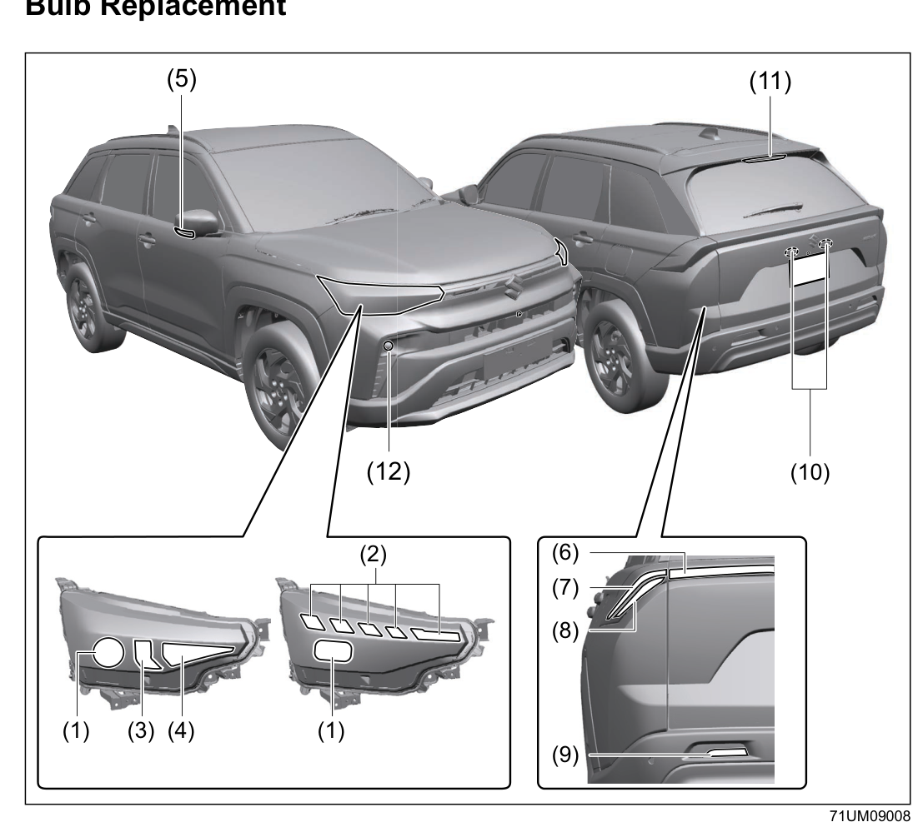

# Bulb Replacement
## Bulb Location Overview

## Exterior Bulb Specifications
| No. | Light | Wattage | Bulb No. |
|-----|-------|---------|----------|
| (1) | Headlight (halogen) | 12V 55W | HIR2 |
| (1) | Headlight (LED)*¹ | LED | — |
| (2) | Front turn signal, position light and DRL*¹ | LED | — |
| (3) | Position light | 12V 5W | W5W |
| (4) | Front turn signal light | 12V 21W | WY21W |
| (5) | Side turn signal light*¹ | LED | — |
| (6) | Tail light (if equipped)*¹ | LED | — |
| (7) | Brake light and tail light*¹ | LED | — |
| (8) | Rear turn signal light*¹ | LED | — |
| (9) | Reversing light | 12V 16W | W16W |
| (10) | License plate light | 12V 5W | W5W |
| (11) | High mount stop light*¹ | LED | — |

*¹ Non-disassemble type — cannot replace bulb individually. Replace the entire assembly if defective. Consult a Maruti Suzuki authorised workshop.*

## Non-Disassemble Type Lights
The following lights are sealed units — bulbs cannot be replaced individually. If any bulb is defective, the entire assembly must be replaced by a Maruti Suzuki authorised workshop:

- Headlight (LED type, if equipped)
- Front turn signal light, position light and daytime running light (if equipped)
- Tail/brake light (if equipped)
- Side turn signal light / hazard warning light on outside rearview mirrors (if equipped)
- High mount stop light
- Front fog light (if equipped)

> [!notice] The inner surface of headlight or rear combination light lenses may appear clouded or show condensation after driving in rain or after washing. This is a normal temporary phenomenon caused by temperature differences and is not a malfunction. However, if water pools inside the lights or large droplets adhere to the inner surface, have the vehicle inspected at a Maruti Suzuki authorised workshop.

> [!caution]
> - Light bulbs can be hot enough to burn your finger right after the lights are turned off — especially halogen bulbs. Wait until they cool before handling.
> - Halogen headlight bulbs are filled with pressurised gas and can burst if hit or dropped. Handle carefully.
> - Wear gloves and a long-sleeved shirt when replacing bulbs to avoid cuts from sharp-edged parts.

> [!notice]
> - Oils from your skin can cause a halogen bulb to overheat and burst. Grasp new bulbs with a clean cloth.
> - Frequent bulb replacement suggests a need for electrical system inspection — consult a Maruti Suzuki authorised workshop.
> - Always use the same bulb number as the original (imprinted on the bulb or listed above).

## External Light Replacement
### Headlights
**LED headlights:** Special procedures required — take to a Maruti Suzuki authorised workshop.

**Halogen headlights (DIY):**
1. Remove the dust cover (2) from the back of the headlight housing.
2. Disconnect the coupler (3) by pushing the lock release.
3. Turn the bulb (4) counterclockwise and remove it.
4. Install the new bulb in reverse order.

### Side Turn Signal Light (on Outside Rearview Mirrors)
LED module — special procedures required. Take to a Maruti Suzuki authorised workshop.

### Daytime Running Light (if equipped)
Special procedures required — take to a Maruti Suzuki authorised workshop.

### Front Turn Signal Light and Front Position Light (if equipped)
**Vehicle with LED headlights:** Special procedures required — take to a Maruti Suzuki authorised workshop.

**Vehicle with halogen headlights (DIY):**
1. Open the engine hood. Turn the bulb holder of the front turn signal light (1) or front position light (2) counterclockwise and pull it out of the housing.
2. To remove the front turn signal bulb: push in and turn counterclockwise. To install: push in and turn clockwise.
3. To remove and install the front position light bulb: simply pull out or push in.

### Front Fog Light (if equipped)
Special procedures required — take to a Maruti Suzuki authorised workshop.

### Rear Combination Light
Special procedures required — take to a Maruti Suzuki authorised workshop.

### Reversing Light
Special procedures required — take to a Maruti Suzuki authorised workshop.

### Tail Light (if equipped)
Special procedures required — take to a Maruti Suzuki authorised workshop.

### License Plate Light (DIY)
1. Turn the cover (1) counterclockwise to remove it.
2. Pull the bulb (2) straight out and push the new one in to install.

### High Mount Stop Light
Special procedures required — take to a Maruti Suzuki authorised workshop.

## Interior Light Replacement
### Front Dome Light — Without Overhead Console (DIY)
1. Insert a flat-blade screwdriver wrapped in a soft cloth between the roof lining (1) and lamp (2), and pry the lamp out.
2. Rotate the bulb holder (3) slightly counterclockwise to remove it from the lamp.
3. Pull the bulb out and insert a new one.
4. Reinstall the bulb holder into the lamp, then press the lamp back into the roof lining.

### Front Dome Light — With Overhead Console, Without Sunroof (DIY)
1. Open the lid (1).
2. Remove the bolt (2).
3. Insert a screwdriver wrapped in soft cloth between the roof lining (3) and lamp (4) and pry the lamp out.
4. Rotate the bulb holder (5) slightly counterclockwise to remove it from the lamp.
5. Pull the bulb out and insert a new one.
6. Reinstall in reverse order, then refit the bolt.

### Front Dome Light — With Overhead Console and Sunroof (DIY)
1. Open the lid (1).
2. Remove the bolt (2).
3. Insert a screwdriver wrapped in soft cloth between the roof lining (3) and lamp (4) and pry the lamp out.
4. Rotate the bulb holder (5) slightly counterclockwise to remove it from the lamp.
5. Pull the bulb out and insert a new one.
6. Reinstall in reverse order, then refit the bolt.

### Center Interior Light (DIY)
1. Insert a screwdriver wrapped in soft cloth into the notch (1) and remove the lens (2).
2. Pull the bulb out and insert a new one.
3. Reinstall the lens in reverse order.

### Luggage Compartment Light (if equipped) (DIY)
1. Insert a screwdriver wrapped in soft cloth into the notch (1) and remove the lens (2).
2. Pull the bulb out and insert a new one.
3. Reinstall the lens in reverse order.

### Courtesy Light (if equipped) (DIY)
1. Insert a screwdriver wrapped in soft cloth into the notch (1) and remove the lens (2).
2. Pull the bulb out and insert a new one.
3. Reinstall the lens in reverse order.

### Vanity Mirror Light (if equipped) (DIY)
1. Insert a screwdriver wrapped in soft cloth into the notch (1) and remove the lens (2).
2. Pull the bulb (3) out and insert a new one.
3. Reinstall the lens in reverse order.

### Glove Box Light (if equipped) (DIY)
1. Press inward on both sides of the glove box, pull it forward and unclamp it.
2. Pull the bulb out and insert a new one.
3. Reinstall in reverse order.

### Front Footwell Lights (if equipped)
Special procedures required — take to a Maruti Suzuki authorised workshop.

### Instrument Panel Assistant Ornament Ambient Light (if equipped)
Special procedures required — take to a Maruti Suzuki authorised workshop.

### Front / Rear Door Ambient Light (if equipped)
Special procedures required — take to a Maruti Suzuki authorised workshop.
