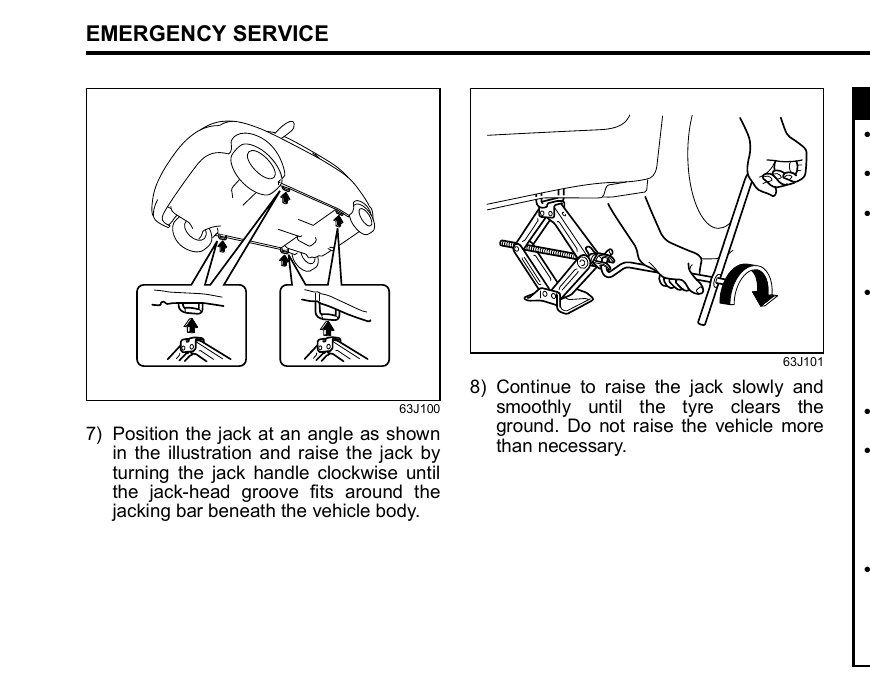
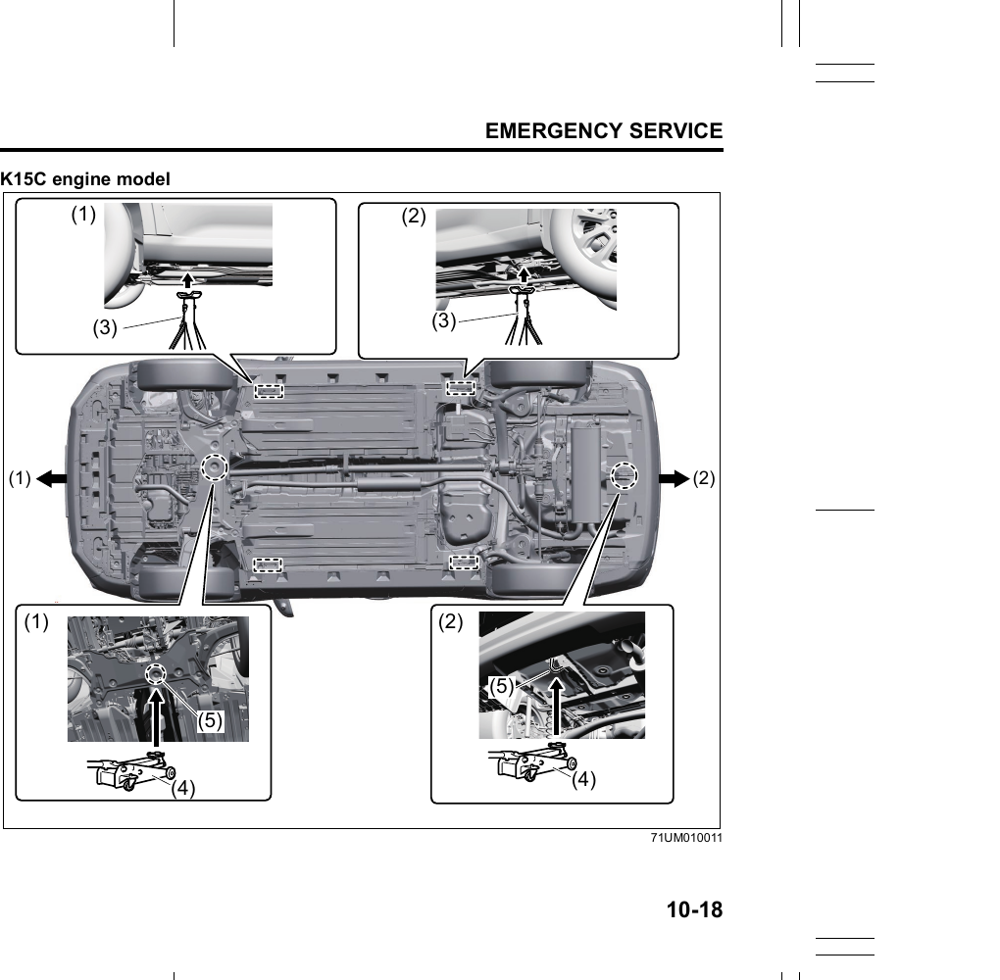
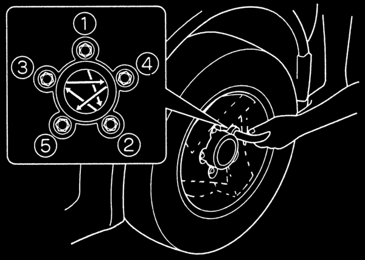

# Jacking Instructions
> **CAUTION:** The jack should be used only to change wheels. Read these instructions fully before attempting to use the jack.

> **NOTICE:** To avoid damaging the storage bracket, do not expand the jack excessively.

> **WARNING:** Never change a wheel in a traffic lane. Always move the vehicle off the road onto level, hard ground away from traffic before changing a wheel. For further assistance, contact your nearest Maruti Suzuki authorized workshop.

## Setting Up
1. Place the vehicle on level, hard ground.
2. Shift into **P** (Park) and set the parking brake firmly.
3. Turn on the hazard warning switch if your vehicle is near traffic.
4. If your vehicle has a smart power tailgate, turn off the smart power tailgate system.
5. Block the front and rear of the wheel diagonally opposite to the wheel being lifted.

## Positioning and Raising the Jack

6. Position the jack at an angle as shown in the illustration and raise it by turning the jack handle clockwise until the jack-head groove fits around the jacking bar beneath the vehicle body.
7. Continue to raise the jack slowly and smoothly until the tyre clears the ground. Do not raise the vehicle more than necessary.

> **WARNING:**
> - Shift into **P** (Park) when jacking up the vehicle.
> - Never jack up the vehicle with the transmission in **N** (Neutral) — an unstable jack may cause an accident.
> - Use the jack only on level, hard ground. Never jack up the vehicle on an inclined surface.
> - Only position the jack between the frame bosses near the wheel being changed.
> - Make sure the jack is raised at least 25 mm before it contacts the boss. Using the jack within 25 mm of fully collapsed may cause it to fail.
> - Do not use wooden blocks or similar objects as a jack underlay.
> - No person should place any part of their body under a vehicle supported by a jack.
> - Never run the engine when the vehicle is supported by a jack, and never allow passengers to remain in the vehicle.

## Raising with a Garage Jack
If using a garage jack, apply it to one of the designated points below. Always support the raised vehicle with jack stands at these same points.

- **(1) Front** jacking point
- **(2) Rear** jacking point
- **(3)** Jack stand position
- **(4)** Garage jack position
- **(5)** Jacking point for garage jack

> **WARNING:** Only use the designated points shown in the illustrations. When holding the vehicle lifted, use a rigid rack. When jacking up the front or rear only, place chocks on the front and rear of the grounded tyres.

## Changing the Wheel
> **CAUTION:** Immediately after driving, the wheels, wheel nuts, and area around the brakes may be extremely hot. Do not touch these areas until they have cooled down.

1. Prepare the jack and tools.
2. Loosen — but do not remove — the wheel nuts.
3. Jack up the vehicle following the steps above.
4. Remove the wheel nuts and wheel.
5. Clean any mud or dirt off the wheel mounting surface, hub, thread area, and wheel nut faces with a clean cloth. The hub may be hot — take care.
6. Install the new wheel and replace the wheel nuts with their cone-shaped end facing the wheel. Tighten each nut snugly by hand until the wheel is securely seated on the hub.
7. Lower the jack and fully tighten the nuts with a wrench in the numerical order shown in the illustration.

**Tightening torque for wheel nuts: 100 Nm (10.2 kg-m)**

> **WARNING:** Use genuine wheel nuts and tighten them to the specified torque as soon as possible after changing wheels. Incorrect or improperly tightened wheel nuts may come loose or fall off, causing an accident. If you do not have a torque wrench, have the torque checked at a Maruti Suzuki authorized workshop.

## Full Wheel Cover (if equipped)
Your vehicle includes two tools — a wheel wrench and a jack crank — one of which has a flat end. Use the flat-end tool wrapped in soft cloth to remove the full wheel cover. When reinstalling the cover, make sure it does not cover or foul the air valve.

> **WARNING:** After using the tyre changing tools, stow them securely — unsecured tools can cause injury in an accident.
