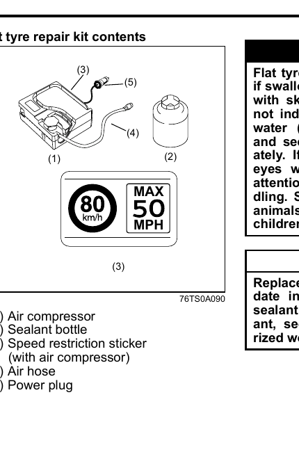
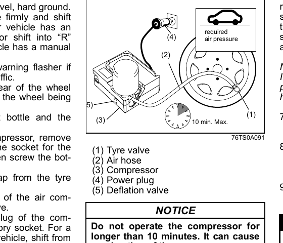

# Flat Tyre Repair Kit
> **WARNING:** Failure to follow these instructions when using the flat tyre repair kit can increase the risk of loss of control and an accident. Read and follow all instructions carefully.

The flat tyre repair kit is stowed in the luggage compartment.

## When the Kit Cannot Be Used
> **NOTICE:** The flat tyre repair kit cannot be used in the following cases — consult a Maruti Suzuki authorized workshop instead:
> - Cuts or piercing in the tyre tread larger than approximately 4 mm.
> - Cuts in the tyre sidewall.
> - Tyre damage caused by driving with considerably reduced tyre pressure or with a fully deflated tyre.
> - The tyre bead completely unseated outside the rim.
> - The rim is damaged.

Small punctures in the tyre tread caused by a nail or screw can be sealed with the kit. Do not remove nails or screws from the tyre during an emergency repair.

## Kit Contents

| Label | Item |
|-------|------|
| (1) | Air compressor |
| (2) | Sealant bottle |
| (3) | Speed restriction sticker (stored with air compressor) |
| (4) | Air hose |
| (5) | Power plug |

> **WARNING:** The sealant is harmful if swallowed or if it contacts skin or eyes. If swallowed, do not induce vomiting — give plenty of water (charcoal slurry if available) and seek immediate medical attention. If it contacts eyes, flush with water and seek medical attention. Wash thoroughly after handling. Can be poisonous to animals. Keep out of reach of children and animals.

> **NOTICE:** Replace the sealant before the expiry date shown on the sealant bottle label. Purchase replacement sealant from a Maruti Suzuki authorized workshop.

## Emergency Repair Procedure
1. Place the vehicle on level, hard ground. Shift into **P** (Park) and set the parking brake firmly. Turn on the hazard warning flasher if near traffic. Block the front and rear of the wheel diagonally opposite to the wheel being repaired.
2. Take out the sealant bottle and the compressor.
3. At the top of the compressor, remove the cap covering the socket for the sealant bottle, then screw the bottle into the socket.
4. Unscrew the valve cap from the tyre valve.
5. Connect the air hose of the compressor to the tyre valve.
6. Connect the power plug to the accessory socket. Start the engine. Switch on the compressor and inflate the tyre to the required air pressure.

> **NOTICE:** Do not operate the compressor for longer than 10 minutes — it can overheat.

If the tyre cannot be inflated to the required pressure within 5 minutes, move the vehicle a few metres back and forth to spread the sealant over the entire inner tyre surface, then inflate again.

If the tyre still cannot reach the required pressure, it may be too severely damaged for the kit to seal. Consult a Maruti Suzuki authorized workshop.

> **NOTE:** If the tyre is over-inflated, release air using the deflation valve (5) on the filler hose.

7. Affix the speed restriction sticker (from the air compressor) in the driver's field of view.

> **WARNING:** Do not affix the speed restriction sticker to an airbag, warning light indicator, or speedometer.

8. Drive carefully immediately after inflating, at a maximum speed of **80 km/h**.
9. Drive carefully to the nearest Maruti Suzuki authorized workshop.
10. After 10 km of driving, check the tyre pressure using the compressor's pressure gauge. If the reading is above 220 kPa (2.2 bar), the emergency repair is complete. If the pressure is below the required level, correct it. If the pressure has dropped below 130 kPa (1.3 bar), the kit cannot provide a seal — do not continue using the tyre and consult a workshop immediately.

> **WARNING:** Check the tyre pressure after 10 km to confirm the repair is holding.

## After the Emergency Repair
> **NOTICE:**
> - Have the tyre renewed at the nearest Maruti Suzuki authorized workshop. Consult a tyre repair shop before reusing a sealed tyre.
> - The wheel can be reused after wiping off all sealant with a cloth to prevent rust, but the tyre valve and TPMS sensor must be renewed.
> - Dispose of the used sealant bottle and air hose at a Maruti Suzuki authorized workshop or in accordance with local regulations.
> - After using the sealant bottle and air hose, replace them with new ones from your Maruti Suzuki authorized workshop.

## Using the Compressor to Inflate a Tyre (Without Sealant)
1. Place the vehicle on level, hard ground. Shift into **P** (Park) and set the parking brake firmly.
2. Take out the compressor.
3. Unscrew the valve cap from the tyre valve.
4. Connect the air hose of the compressor to the tyre valve.
5. Connect the power plug to the accessory socket. Start the engine. Switch on the compressor and inflate the tyre to the required air pressure.

> **NOTICE:** Do not operate the compressor for longer than 10 minutes — it can overheat.
