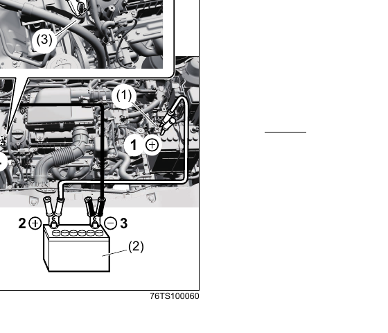

# Jump-starting Instructions
> **WARNING:**
> - Never attempt to jump-start the vehicle if the lead-acid battery appears to be frozen — batteries in this condition may explode.
> - When making jump lead connections, keep your hands and the jump leads clear of pulleys, belts, and fans.
> - Lead-acid batteries produce flammable hydrogen gas. Keep flames and sparks away from the battery — never smoke when working near it.
> - If the booster battery is in another vehicle, check that the two vehicles are not touching each other.
> - If the lead-acid battery discharges repeatedly for no apparent reason, have the vehicle inspected at a Maruti Suzuki authorized workshop.

> **NOTICE:**
> - Do not attempt to start the vehicle by pushing or towing — this can permanently damage the catalytic converter. Use jump leads to start a vehicle with a weak or flat battery.
> - Do not charge the 12-volt battery while the hybrid system is activating. Ensure all accessories are turned off.

## Procedure

**(1)** = positive (+) terminal of the discharged battery | **(2)** = booster battery | **(3)** = engine mount bolt

1. Use only a 12-volt lead-acid battery to jump-start the vehicle. Position the booster battery close enough for the jump leads to reach both batteries. If using a battery in another vehicle, ensure the two vehicles are not touching each other. Set the parking brakes fully on both vehicles.
2. Turn off all vehicle accessories, except those necessary for safety (e.g. headlights or hazard lights).
3. Connect the jump leads in the following order:
   - **Lead 1 —** Connect one end to the **positive (+) terminal of the discharged battery (1)**.
   - **Lead 1 —** Connect the other end to the **positive (+) terminal of the booster battery (2)**.
   - **Lead 2 —** Connect one end to the **negative (−) terminal of the booster battery (2)**.
   - **Lead 2 —** Connect the other end to an **unpainted, heavy metal part of the engine — specifically the engine mount bolt (3)** on the engine cylinder head of the vehicle with the discharged battery. Do not connect to the negative (−) terminal of the discharged battery.

> **WARNING:** Never connect the final jump lead directly to the negative (−) terminal of the discharged battery — an explosion may occur.

> **CAUTION:** Connect the jump lead to the engine mount bolt securely. If it disconnects due to engine vibration at start-up, the lead could be caught in the drive belts.

4. If the booster battery is in another vehicle, start that vehicle's engine and run it at moderate speed.
5. Start the engine of the vehicle with the discharged battery.
6. Remove the jump leads in the **exact reverse order** from which they were connected.
