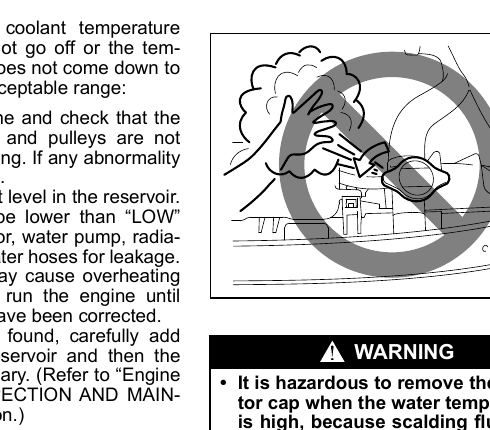

# Engine Trouble
## Starter Does Not Operate
1. Turn the ignition to START with the headlights on to check the battery condition.
   - If the headlights go excessively dim or go off, the lead-acid battery is likely discharged or the battery terminal contact is poor. Recharge the battery or correct the terminal contact.
2. If the headlights remain bright, check the fuses. If the cause is not obvious, there may be a major electrical problem — have the vehicle inspected at a Maruti Suzuki authorized workshop.

## Engine Does Not Start
First check that the vehicle has enough fuel and that the battery is charged.

If the engine does not start in very cold conditions, press the accelerator pedal all the way to the floor and hold it while cranking.

Refer to [[05-06 Starting Stopping Engine or Hybrid System]] if needed.

If the engine still does not start, have the vehicle inspected at a Maruti Suzuki authorized workshop.

> **NOTICE:** Do not operate the starter motor for more than 12 seconds at a time.

> **NOTE:** If the engine refuses to start, the starter motor automatically stops after a set period. After it has auto-stopped, or if there is any abnormality in the starting system, the starter will only run while the engine switch is held pressed.

## Engine Overheating
The engine may overheat temporarily under severe driving conditions. If the high engine coolant temperature warning light comes on, or the coolant temperature gauge indicates overheating while driving:

1. Turn off the air conditioner.
2. Move the vehicle to a safe place and park.
3. Run the engine at normal idle speed for a few minutes until the warning light goes off or the temperature gauge returns to within the normal range (between "H" and "C").

> **WARNING:** If you see or hear escaping steam, stop the vehicle immediately in a safe place and turn off the engine. Do not open the hood while steam is present. Once the steam can no longer be seen or heard, open the hood to check whether the coolant is still boiling — if it is, wait until it stops before proceeding.

If the warning light does not go off or the temperature does not return to the normal range after following the steps above:

1. Turn off the engine and check that the water pump belt and pulleys are not damaged or slipping. Correct any abnormality found.
2. Check the coolant level in the reservoir. If it is below the "LOW" line, check the radiator, water pump, radiator hoses, and heater hoses for leaks. If a leak that could cause overheating is found, do not run the engine until it has been fixed.
3. If no leak is found, carefully add coolant to the reservoir and then to the radiator if necessary. Refer to [[09-05 Engine Coolant]] for details.

> **WARNING:**
> - Do not remove the radiator cap when the coolant temperature is high — scalding fluid and steam may be blown out under pressure. Only remove the cap once the coolant temperature has lowered.
> - Keep hands, tools, and clothing away from the engine cooling fan and air-conditioner fan. These electric fans can turn on automatically without warning.

> **NOTE:** If the engine overheats and you are unsure what to do, contact a Maruti Suzuki authorized workshop.
