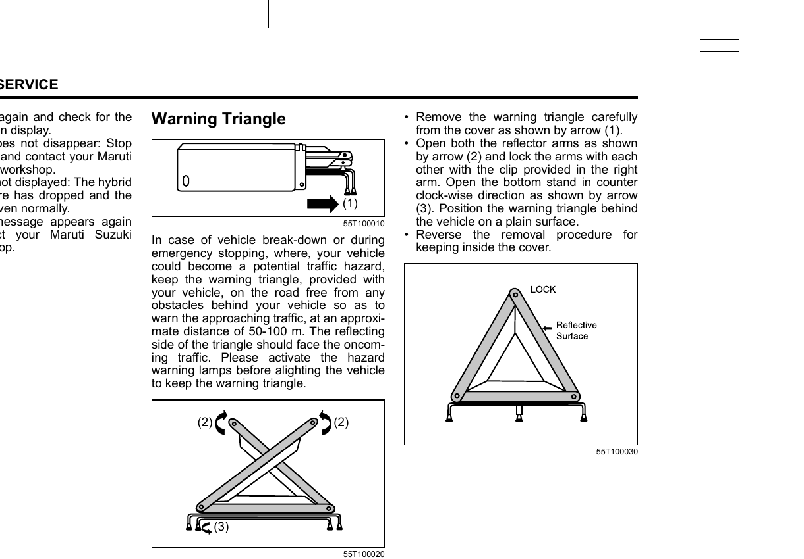

# Warning Triangle
In case of vehicle breakdown or emergency stopping where your vehicle could become a traffic hazard, place the warning triangle on the road behind your vehicle, free from obstacles, to warn approaching traffic at an approximate distance of 50–100 m. The reflective side of the triangle should face the oncoming traffic. Activate the hazard warning lamps before leaving the vehicle to place the triangle.

## Setting Up
1. Remove the warning triangle carefully from its cover in the direction of arrow **(1)**.
2. Open both reflector arms in the direction of arrows **(2)** and lock them together with the clip provided in the right arm.
3. Open the bottom stand in the counter-clockwise direction as shown by arrow **(3)**.
4. Position the warning triangle behind the vehicle on a plain surface, reflective side facing oncoming traffic.

To store the triangle, reverse the above steps.
