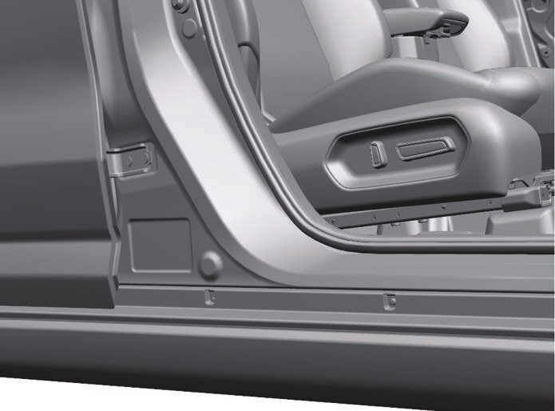
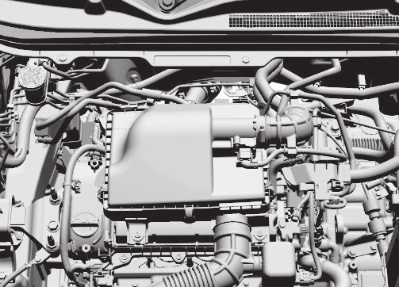

# Vehicle Identification
## Chassis Serial Number

The chassis and/or engine serial numbers are used to register the vehicle. They are also used to assist a Maruti Suzuki authorized workshop when ordering or referring to special service information. Whenever you have occasion to consult a Maruti Suzuki authorized workshop, remember to identify your vehicle with this number. Should you find the number difficult to read, you will also find it on the identification plate.
## Engine Serial Number
### K15C Engine
The engine serial number is stamped on the cylinder block as shown in the illustration.
