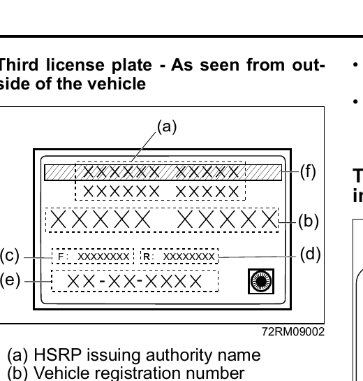

# High Security Registration Plate (HSRP) (if applicable)
As per Ministry of Road Transport and Highways, every new vehicle must have HSRP.

HSRP contains:
- Front and rear HSRP, which will be fitted with 2 snap-locks each on number plate area.
- Third license plate on front windshield.
## Third License Plate
### Third License Plate — As Seen From Outside the Vehicle

**(a)** HSRP issuing authority name
**(b)** Vehicle registration number
**(c)** Unique laser number – Front plate
**(d)** Unique laser number – Rear plate
**(e)** Date of 1st registration (in DD-MM-YYYY format)
**(f)** Green strips (BS6 vehicle)

> **NOTE:** The picture shown is for indicative purpose only. Internal structure of actual label mounted on vehicle may be different.

> **NOTE:**
> - Any attempt to remove the third license plate from the windscreen will result in permanent damage to the label.
> - Use of chemical cleaners to clean the windscreen area where the label is mounted can damage the same.
> - Use of any sharp objects on the label can damage the label.
> - In the event of any replacement of the third license plate, please contact the approved authority.
### Third License Plate — As Seen From Inside the Vehicle
> **Notice:** It is unlawful for any person to duplicate, alter, change, deface, destroy, mutilate, remove, tear down this Third Registration Plate Sticker, except if done by authority of law. Do not wipe with harsh abrasive materials, detergents, etc. as it may deface or damage this sticker.

> **NOTE:** The picture shown is for indicative purpose only.

> **NOTE:** Color of third license plate (back) is as per HSRP regulation as defined by Ministry of Road Transport and Highways.
